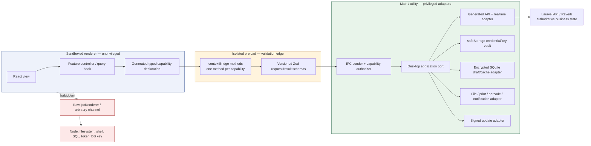

# C4 Level 3 — Electron desktop trust boundary

Scope: the internal component and privilege boundaries shared by the doctor and
pharmacy desktop deployment units. Domain workflows and capability sets remain
persona-specific. Source: ADR 0010 and Phase 00 "Client architecture".

## Dependency rules

1. Renderer features import only pure TypeScript/React packages and the
   generated bridge declaration. They cannot import Electron, Node, native
   modules, desktop credentials, database adapters, or provider SDKs.
2. Preload translates a fixed method into one fixed IPC operation. It validates
   and size-bounds values, strips Electron event objects, and exposes an
   unsubscribe function for subscriptions. It contains no domain rule.
3. Main validates the exact sender origin, top frame, window, schema, deadline,
   rate, actor/device context, and allowed state transition before invoking a
   port. Tenant, branch, profile, environment, filesystem path, and database
   namespace are derived outside renderer input.
4. Utility processes isolate native/blocking encrypted-database work when the
   compatibility spike proves that boundary. They receive intent-named
   commands, never renderer-provided SQL.
5. Laravel remains authoritative. The doctor store is a bounded encrypted
   draft/outbox; pharmacy inventory, POS, payment, and financial writes stay
   online and server-authoritative.

## Window and storage controls

- Load signed local assets through the approved application protocol; do not
  load remote code or grant renderer HTTP/realtime authority.
- Set `nodeIntegration: false`, `nodeIntegrationInWorker: false`,
  `contextIsolation: true`, `sandbox: true`, `webviewTag: false`, and
  `webSecurity: true`; apply a restrictive CSP.
- Deny unexpected navigation, child windows, permissions, downloads, and
  external protocols. Any allowed external HTTPS link uses a main-owned exact
  host policy.
- Keep renderer storage nonpersistent for clinical state. Credentials and
  database keys are main-only; Linux `safeStorage` with the `basic_text`
  backend fails closed.
- Doctor and pharmacy use separate application IDs, data directories,
  databases, device credentials, window policies, and IPC capability maps.

## Verification

- Static dependency tests reject privileged imports in renderer and generic
  IPC methods in preload.
- Unit/contract tests cover every schema, sender decision, safe error, deadline,
  cancellation, rate limit, idempotency key, and subscription cleanup.
- Packaged E2E tests prove allowed workflows and denial of hostile IPC,
  navigation, popups, permissions, external URLs, and renderer attempts to
  reach Node or secrets.
- Target-OS system tests cover installation, encrypted native-module ABI,
  signing/notarization, authenticated updates, upgrade/rollback, printers,
  barcode devices, proxy/TLS, restart, disk failure, and uninstall behavior.
