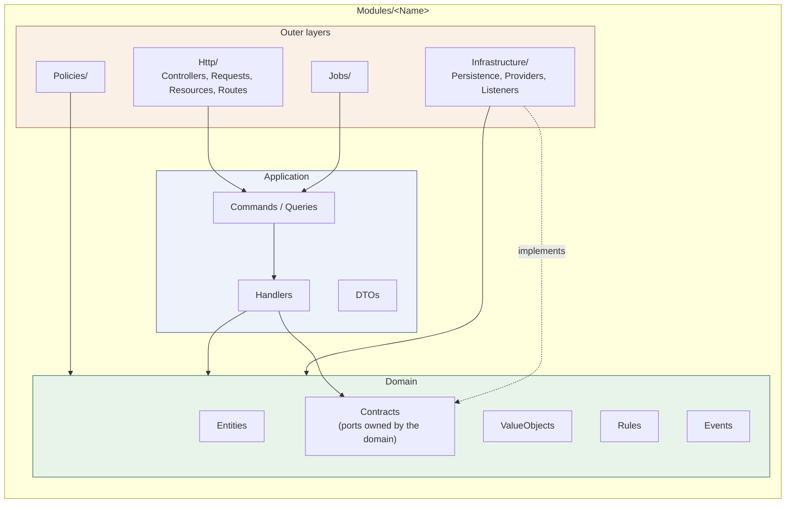
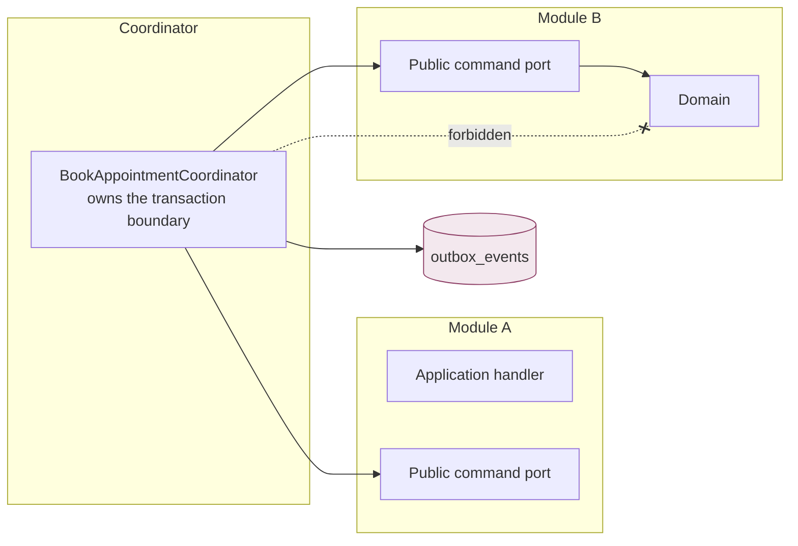

# C4 Level 3 — Component view: module dependency direction

Scope: the internal structure of one Laravel module and the permitted direction
of dependencies, which is the rule `deptrac` enforces in CI. Source: phase file
"Laravel module layout" and "Cross-module transaction coordination";
`plan.md` sections 2 and 174.

## Inward dependency rule

```text
HTTP / Infrastructure / Jobs  ->  Application  ->  Domain
Domain  ->  PHP standard library and domain-owned interfaces only
```

Nothing points inward-out. Domain never imports Application, Infrastructure,
HTTP, Eloquent, Laravel facades, or any provider SDK.



The dotted edge is the dependency inversion: `Infrastructure` implements an
interface that `Domain` owns, so the arrow of ownership points inward even
though the runtime call goes outward.

## Layer responsibilities

| Layer | Does | Does not |
| --- | --- | --- |
| `Http/` | Authenticate, validate transport input, build one command or query, invoke one handler, map the result | Contain business transitions or reach into Eloquent |
| `Application/` | Coordinate the transaction and the ports, enforce idempotency | Format HTTP responses or call facades hidden from tests |
| `Domain/` | Enforce invariants, expose intent-revealing transitions | Know about HTTP, the database, queues, or providers |
| `Infrastructure/` | Implement domain-owned ports for Eloquent, Redis, S3, FCM, SMS, Reverb | Contain business rules |
| `Policies/` | Decide allow or generic denial from a typed authorization context | Trust a client-supplied role, tenant, doctor, patient, or scope identifier |
| `Jobs/` | Carry stable IDs and schema versions, reload current state, re-authorize, stay idempotent | Assume state captured at dispatch is still valid |

## Cross-module direction



A module reaches another module only through a public application port or a
published event. Direct module-to-module table writes are prohibited, and a
coordinator never imports another module's Eloquent model.

## Approved coordinators

Named in the phase file; each owns one transaction boundary.

| Coordinator | Participating modules | Commits atomically |
| --- | --- | --- |
| `BookAppointmentCoordinator` | Appointments (availability/booking), Identity (patient reference) | appointment, slot constraint, status event, audit, idempotency, outbox |
| `StartConsultationCoordinator` | Queue (checked-in eligibility), Clinical (encounter + access grant), Appointments (state) | encounter, access grant, appointment state, sanitized current-patient outbox event |
| `CompleteConsultationCoordinator` | Clinical (finalize + revoke access), Queue (advance), Appointments (complete), Chat (write window) | all of the above plus outbox notifications |
| `CompleteSaleCoordinator` | POS (cart/payment intent), Inventory (FEFO allocation + movements) | invoice, payment, movements, outbox |

Architecture tests must prove that only the approved coordinator uses the
participating command ports, and that an integration-event handler cannot
perform a delayed write that the originating invariant required.

## Enforcement

| Rule | Enforced by |
| --- | --- |
| Domain imports no framework or provider code | `deptrac` layer rules + unit dependency test |
| No cross-module infrastructure or model import | `deptrac` ruleset + architecture test |
| Only the approved coordinator calls a participating port | Architecture test |
| A forbidden dependency actually fails the build | Deliberate fixture proven to fail, then removed (Phase 00 §1.5, gate G-01-05) |
