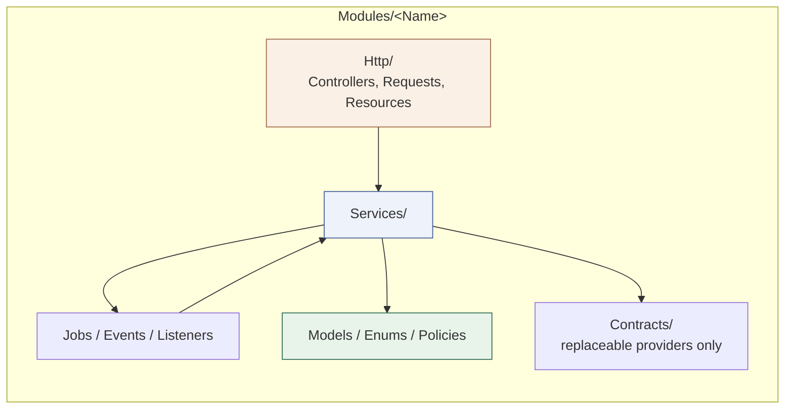
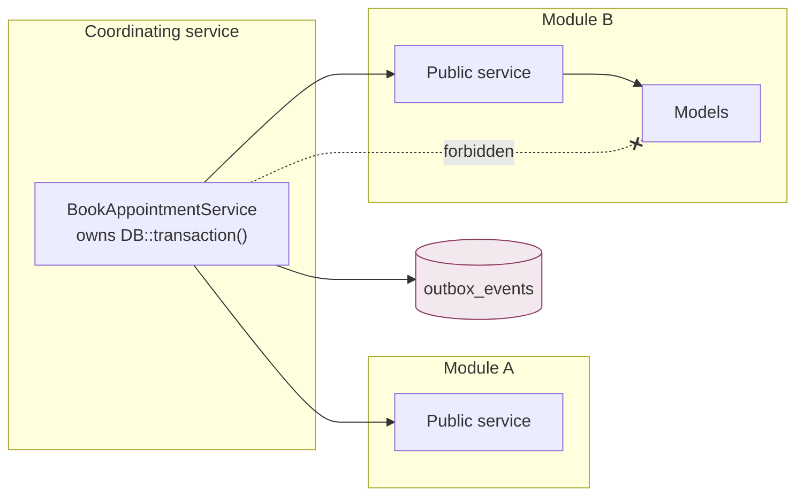

# C4 Level 3 — Component view: module dependency direction

Scope: the internal structure of one Laravel module and the permitted direction
of dependencies, which is the rule `deptrac` enforces in CI. Source: phase file
"Laravel module layout" and "Cross-module transaction coordination";
`plan.md` sections 2 and 174.

## Conventional module shape

Each business module lives at `apps/core-api/Modules/<Name>/` and is a
conventional mini Laravel application managed by `nwidart/laravel-modules`.

```text
HTTP (controllers, Form Requests, Resources)
  -> module Services
  -> Eloquent models / policies / jobs / events
External SDKs -> focused services or a small app/Contracts interface
```

Controllers authenticate, validate, call one descriptive module service, and
map the result. Services own workflows, transactions, idempotency, and
cross-module calls. Do not reintroduce `Domain`, `Application`, or
`Infrastructure` directories, handler-per-action trees, or `*Port` types.



## Layer responsibilities

| Folder | Does | Does not |
| --- | --- | --- |
| `Http/` | Authenticate, validate transport input, call one module service, map the result | Contain multi-step business workflows |
| `Services/` | Coordinate the transaction, Eloquent writes, idempotency, and cross-module calls | Format HTTP envelopes or call another module's tables |
| `Models/` | Relationships, casts, scopes, small model-local behavior | Authorize from a client-supplied role or tenant id |
| `Contracts/` | Narrow interfaces for a genuinely replaceable provider | A second architecture of ports wrapping ordinary Eloquent |
| `Policies/` | Decide allow or generic denial from a typed authorization context | Trust a client-supplied role, tenant, doctor, patient, or scope identifier |
| `Jobs/` | Carry stable IDs and schema versions, reload current state, re-authorize, stay idempotent | Assume state captured at dispatch is still valid |

## Cross-module direction



A module reaches another module only through a public module service or a
published event. Direct module-to-module table writes are prohibited, and a
coordinating service never imports another module's persistence types.

## Approved coordinating services

Named in the phase file; each owns one transaction boundary.

| Service | Participating modules | Commits atomically |
| --- | --- | --- |
| `BookAppointmentService` | Appointments (availability/booking), Identity (patient reference) | appointment, slot constraint, status event, audit, idempotency, outbox |
| `StartConsultationService` | Queue (checked-in eligibility), Clinical (encounter + access grant), Appointments (state) | encounter, access grant, appointment state, sanitized current-patient outbox event |
| `CompleteConsultationService` | Clinical (finalize + revoke access), Queue (advance), Appointments (complete), Chat (write window) | all of the above plus outbox notifications |
| `CompleteSaleService` | POS (cart/payment intent), Inventory (FEFO allocation + movements) | invoice, payment, movements, outbox |

Architecture tests must prove that only the approved coordinating service uses
the participating module services, and that an integration-event consumer cannot
perform a delayed write that the originating invariant required.

## Enforcement

| Rule | Enforced by |
| --- | --- |
| Platform does not import a business module | `deptrac` module rules + architecture test |
| No cross-module model or persistence import from an outbox consumer | `deptrac` ruleset + architecture test |
| DDD `Domain/Application/Infrastructure` trees do not return | Architecture test |
| Only the approved coordinating service spans modules in one transaction | Architecture test allow-list |
| A forbidden dependency actually fails the build | Deliberate fixture proven to fail, then removed (Phase 00 §1.5, gate G-01-05) |
