# C4 Level 2 — Containers

Scope: the deployable and runnable pieces inside the clinic platform, and the
protocols between them. Source: `plan.md` sections 1–3, 99, 102–104, 113–114,
135–142, 166; phase file "System boundaries" and "Repository layout".

```mermaid
C4Container
    title Clinic platform — containers

    Person(clients, "Patient / Doctor / Pharmacy / Admin users", "Four client applications")

    Container_Boundary(platform, "Clinic platform") {
        Container(gateway, "API gateway / load balancer", "Nginx or managed LB", "TLS termination, request-size limits, coarse abuse controls, routing")

        Container(patientApp, "Patient app", "Flutter, Android + iOS", "Booking, queue status, records, medicine search")
        Container(doctorApp, "Doctor desktop", "Flutter Desktop", "Queue, consultations, clinical drafts with local outbox")
        Container(pharmacyApp, "Pharmacy desktop", "Flutter Desktop", "Inventory, purchasing, POS")
        Container(adminWeb, "Admin web", "React + TypeScript + Vite", "Verification, catalog, analytics, system health")

        Container(coreApi, "Core API", "Laravel 13 on Octane + FrankenPHP", "Authentication, authorization, all operational, clinical, and financial state")
        Container(reverb, "Realtime server", "Laravel Reverb", "Private WebSocket channels, authorized per subscription")
        Container(horizon, "Queue workers", "Laravel Horizon", "critical, notifications, files, integrations, analytics, reports, backups lanes")
        Container(outboxWorker, "Outbox dispatcher", "Laravel worker", "Claims outbox rows with FOR UPDATE SKIP LOCKED, publishes post-commit effects")
        Container(scheduler, "Scheduler", "Laravel scheduler", "Retention, cleanup, reconciliation, periodic jobs")

        Container(aiApi, "AI API", "Python + FastAPI", "Isolated retrieval and generation behind an internal contract")
        Container(aiWorker, "AI workers", "Python", "Ingestion, embedding, and long-running AI work on an AI-owned queue")

        ContainerDb(postgres, "PostgreSQL + PostGIS", "PostgreSQL", "Operational and medical source of truth")
        ContainerDb(redisCache, "Redis A", "Redis", "Cache, rate limits, locks, realtime pub/sub")
        ContainerDb(redisQueue, "Redis B", "Redis", "Laravel queue backend")
        ContainerDb(qdrant, "Qdrant", "Qdrant", "Rebuildable retrieval index")
        ContainerDb(s3, "Object storage", "S3-compatible, private", "Original file source of truth")

        Container(otel, "OpenTelemetry Collector", "OTel", "Trace and metric pipeline with redaction verification")
        Container(prom, "Prometheus + Grafana", "Prometheus, Grafana", "Metrics, dashboards, alerts")
    }

    Rel(clients, gateway, "HTTPS / JSON, WSS")
    Rel(gateway, coreApi, "HTTP", "Correlation ID propagated")
    Rel(gateway, reverb, "WebSocket upgrade")

    Rel(coreApi, postgres, "Reads and writes", "Strong consistency, bounded transactions")
    Rel(coreApi, redisCache, "Cache, locks, rate limits")
    Rel(coreApi, redisQueue, "Dispatches jobs")
    Rel(coreApi, s3, "Signed URLs, private objects")
    Rel(coreApi, aiApi, "Internal command", "Authenticated, versioned, deadline-bound")

    Rel(outboxWorker, postgres, "Claims outbox rows")
    Rel(outboxWorker, redisCache, "Publishes realtime events")
    Rel(horizon, redisQueue, "Consumes PHP jobs")
    Rel(horizon, postgres, "Reloads current state, re-authorizes")
    Rel(reverb, redisCache, "Pub/sub fan-out across nodes")

    Rel(aiApi, qdrant, "Hybrid retrieval")
    Rel(aiApi, aiWorker, "AI-owned TaskQueue")
    Rel(aiApi, coreApi, "Status/result callback", "Authenticated; never writes core tables")

    Rel(coreApi, otel, "Traces and metrics", "Redacted before export")
    Rel(aiApi, otel, "Traces and metrics", "Redacted before export")
    Rel(otel, prom, "Metrics")
```

## Container responsibilities and limits

| Container | Owns | Must never |
| --- | --- | --- |
| Core API | Authentication, authorization, operational/clinical/financial state, tenant scoping, tool authorization | Perform unbounded work inside a request; call a model provider directly |
| Reverb | Private channel delivery | Treat an identifier in a channel name as authorization |
| Queue workers | Post-commit effects on Laravel lanes | Consume Python payloads; assume the state at dispatch time is still current |
| Outbox dispatcher | Claiming and publishing outbox rows | Publish before commit; silently discard an exhausted row |
| AI API | Retrieval, generation, AI-owned queue | Hold a core database credential; write core tables |
| PostgreSQL | Source of truth | Be bypassed by a cache as the authority |
| Redis A / B | Cache, locks, realtime / queue transport | Be the only copy of any authoritative fact |
| Qdrant | Retrieval index | Hold a fact that cannot be rebuilt |
| Object storage | Original files | Serve an object anonymously |

## Deployment-unit independence

Each container builds and deploys independently from `apps/*`. They share only
the contracts in `packages/contracts/` and, for Flutter clients, the packages in
`packages/flutter/` (ADR 0002).

Redis A and Redis B may be one instance in local Compose. The application
addresses them through separate named connections from day one, so production
separation (`plan.md` section 114) is configuration, not a code change.

## Scaling shape

- Core API nodes are stateless behind the load balancer; sessions and cache live
  in Redis, files in object storage (`plan.md` section 135).
- Reverb scales horizontally with Redis fan-out (`plan.md` section 136).
- PostgreSQL scales in the order: indexes, query optimization, PgBouncer,
  caching, read replicas, partitioning, and only then sharding
  (`plan.md` section 137).
- AI inference workers scale separately from the AI API; the core needs no GPU
  (`plan.md` section 140).
