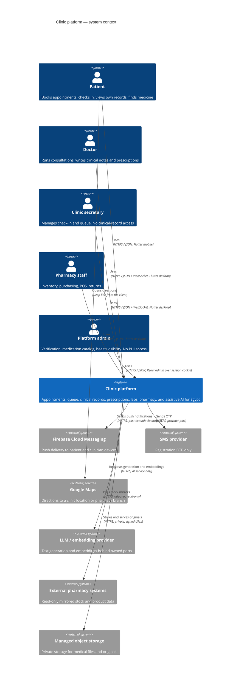

# C4 Level 1 — System context

Scope: the clinic platform as one system, its human actors, and the external
systems it depends on. Source: `plan.md` sections 1–5, 94, 100–101, 151;
`docs/phases/00_cross_cutting_architecture_and_delivery_contract.md`.

## Boundary rules visible at this level

1. Clients never connect directly to PostgreSQL, Redis, object storage, Qdrant,
   or any provider API. Every external call originates server-side.
2. The SMS provider is used for registration OTP only (`plan.md` section 100).
   No clinical or appointment content leaves over SMS.
3. Maps integration is a client-side deep link. The platform does not build a
   navigation engine and does not send patient location to a map provider on the
   server's behalf (`plan.md` sections 150–151).
4. External pharmacy systems are read-only sources. The platform never mutates a
   partner's system (Phase 15 constraint, stated here because it is a boundary
   property).
5. The LLM provider is reachable only from the AI service, never from the core
   (ADR 0001).
6. Admin is an actor without clinical-record access (`docs/phases/README.md`
   invariant 7). This is a system-context property, not only an internal one.

## Trust boundaries

| Boundary | Crossing | Controls |
| --- | --- | --- |
| Public internet → gateway | All client traffic | TLS, request-size limits, coarse abuse controls |
| Gateway → core | Authenticated requests | Session/device token, correlation ID, deny-by-default policy |
| Core → data stores | Private network only | Per-workload credentials, no public exposure |
| Core → AI service | Internal contract | Authenticated, versioned, deadline-bound, minimal references |
| AI service → provider | Egress | Provider port, no raw PHI, budget and timeout controls |
| Admin browser → core | Session and CSRF | HTTP-only cookie, CSRF token, secure headers, no token in local storage |
