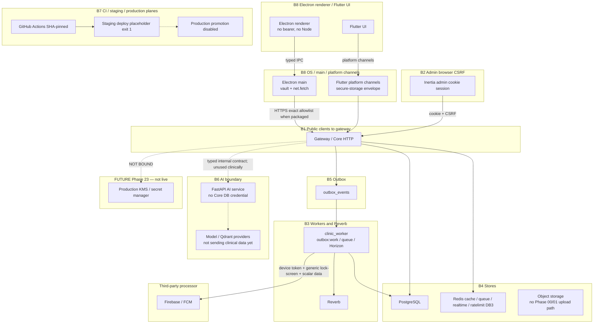

# Threat model — Phase 00 foundation

STRIDE plus privacy analysis across the **eight** trust boundaries named in
`docs/phases/00_cross_cutting_architecture_and_delivery_contract.md`, updated
to the implementation at candidate SHA
`11ffb25c7470c4b42fd535e9780b235de57297e4` (GitHub Actions run
[33398311982](https://github.com/mahmoudemad68/clinical_system/actions/runs/33398311982),
`SUCCESS`).

Scope is the foundation as built: gateway, core API, PostgreSQL role split,
Redis (including the auth rate-limit database), object storage, workers,
Reverb, the AI service boundary, the outbox, first-party clients (Inertia
admin, Electron doctor/pharmacy, Flutter patient), Firebase/FCM as a
third-party push processor, and the developer/CI plane.

**ENGINEERING STATUS:** engineering draft, repository-complete for the eight
boundaries and the current controls below.

**INDEPENDENT/HUMAN ACCEPTANCE:** `PENDING_INDEPENDENT_REVIEW`. Named-owner
acceptance is not independent security/privacy approval. **G-08-04 remains
OPEN / EXTERNAL_HUMAN.** This is not a legal or compliance position.
Independent re-review remains Phase 22.

Method: for each boundary, what crosses it, what an attacker would try, what
stops them today, and what does not.

---

## Independent-acceptance vocabulary

Allowed values in this register (do not treat as approval):

| Value | Meaning |
| --- | --- |
| `NOT_REQUIRED_FOR_TECHNICAL_CONTROL` | Engineering control with no separate human acceptance gate |
| `PENDING_INDEPENDENT_REVIEW` | Technical model exists; independent workshop/sign-off has not occurred |
| `PENDING_INDEPENDENT_ACCEPTANCE` | Exception or High finding still needs an independent acceptor |
| `EXTERNAL_HUMAN` | Legal, privacy-officer, CODEOWNER-team, or G-08-04 decision |
| `OPERATIONAL_FOLLOW_THROUGH` | Live ceremony, staging, promotion, or provider operations not executed |

Do **not** read `ENGINEERING STATUS` as independent acceptance. This document
does not use `APPROVED` or `ACCEPTED`.

**SF-001:** `PENDING_INDEPENDENT_ACCEPTANCE` (canonical
`infra/security/exceptions/SF-001.json`). Merge-only; `promotion_allowed: false`.

**G-08-04:** `OPEN` / `EXTERNAL_HUMAN`.

**G-01-21:** `OPEN` / not PASS because SF-001 remains an unaccepted High.

---

## Current vs future (do not convert plans into mitigations)

**Implemented now (local/CI, not production live):** TLS at the gateway in
deployed *design*; local Compose is loopback. Identity envelope/HMAC ports.
Packaged Electron exact-origin allowlist. SHA-pinned Actions and digest-pinned
CI images. Packaged Doctor + Pharmacy WebdriverIO on Ubuntu, Windows, and
macOS for the SHA above.

**NOT implemented / NOT live:**

- production KMS provider or binding ceremony (Phase 23 /
  `OPERATIONAL_FOLLOW_THROUGH`)
- production TLS certificate ceremony (`OPERATIONAL_FOLLOW_THROUGH`)
- successful staging deploy (post-merge `deploy-staging` is an intentional
  `exit 1`)
- production promotion (hard-disabled)
- live provenance ceremony against a real registry push
- encrypted backup restore drill
- independent legal/privacy approval (`EXTERNAL_HUMAN`)
- Phase 02+ clinical data flows
- live AI provider / cross-border processing (AI port exists; nothing clinical
  is sent in Phase 00/01)

---

## Data-flow diagram — eight trust boundaries

Version-controlled, text-reviewable Mermaid. KMS is **FUTURE / Phase 23**, not
a live processor.

---

## Boundary 1 — Public clients to gateway

**Crosses:** patient mobile, doctor desktop, pharmacy desktop, and admin
browser traffic. Clients are first-party; they are not a second web stack.

| STRIDE | Threat | Control today | Gap |
| --- | --- | --- | --- |
| Spoofing | Stolen device token replayed from another device | Bearer required; refresh is session-linked with a consumed-token ledger; N-2 reuse revokes the family; logout revokes session and device | Flutter OS-backup/keystore matrix remains `OPERATIONAL_FOLLOW_THROUGH` |
| Tampering | Request body altered in transit | TLS at the gateway in deployed environments; local Compose is loopback | Certificate pinning on mobile is a Phase 08 decision |
| Repudiation | Client denies making a request | Correlation ID on every outbox row; identity mutations append `audit_events` | Chain verifier is an operations control, not a legal signature |
| Information disclosure | Error response leaks internals | `ExceptionRenderer` maps throwables to a stable code and safe message | CSRF mismatches use `CSRF_MISMATCH`, distinct from `UNAUTHENTICATED` |
| Denial of service | Oversized payload or credential stuffing | `EnforceRequestBounds` (1 MiB, JSON depth 32); auth rate limits on the named Redis `ratelimit` store (DB index 3) | Adaptive/risk-based limits are not wired |
| Elevation of privilege | Client claims a role in the request | `ActorContext` is server-owned; `ClosedJsonValidator` rejects unknown properties on auth API routes | Contextual grants are resource-scoped; unknown clinical actions still 404 |

**Privacy:** a client-supplied `X-Request-Id` is honoured only if it is a valid
UUIDv7.

---

## Boundary 2 — Admin browser session and CSRF

**Crosses:** first-party Inertia admin (`apps/core-api/resources/js`) cookie
session. Tokens never enter `localStorage`.

| STRIDE | Threat | Control today | Gap |
| --- | --- | --- | --- |
| Spoofing | Cross-site request using the admin session | HTTP-only `SameSite` cookie; cookie hash bound to the Laravel session id after regenerate; web stack uses `ValidateAlwaysCsrf`; API cookie/XSRF sessions use `ValidateCookieCsrf` | Device API login does not treat a bare `Origin` as CSRF (Electron `net.fetch`) |
| Information disclosure | Token readable by injected script | No access token in the admin document | — |
| Tampering | XSS injecting a request | React escaping; API CSP `default-src 'none'`; Inertia CSP `default-src 'self'` | — |
| Elevation of privilege | Admin reaching clinical data | Admin has no clinical read path; grant issue/revoke/disable/erase/export/recovery-apply need admin + privileged AAL2 | Product UI for grants is not shipped; those Access/Identity services have **no HTTP routes** yet |

---

## Boundary 3 — Gateway to core workers and Reverb

| STRIDE | Threat | Control today | Gap |
| --- | --- | --- | --- |
| Spoofing | Direct call bypassing the gateway | Compose binds ports to `127.0.0.1`; `/live` and `/ready` are outside the public API group | Network policy in a real deployment is unbuilt |
| Information disclosure | `/ready` used for reconnaissance | Body carries check names and status only | — |
| Denial of service | Worker or websocket exhaustion | Horizon workers; Reverb `max_connections` 500 and rate limiting on; client events denied | Measured revoke-to-socket-close SLO is an evidence item, not a legal SLA |
| Tampering | Client forging a private channel name | `auth.session.{id}` authorizes the exact live session row; other channels deny | HTTP deny is authoritative if the socket lags |

Workers consume the outbox (`outbox:work`) and Laravel/Horizon queues as
PostgreSQL role `clinic_worker` on the `pgsql_worker` connection.
`WorkerDatabaseIdentity` selects that connection when a worker process boots
(`queue:work`, `horizon` / `horizon:work`, `outbox:work`) and refuses to run
when `current_user` is the HTTP serving role (`clinic_app`) or the worker
username is not `clinic_worker`. HTTP and Octane stay on `pgsql` /
`clinic_app`. Pest HTTP tests still log in as `clinic_migrator` for schema
convenience; they assert the default connection is not `pgsql_worker`.

**Exact `clinic_worker` table privileges after the hardening and diagnostics
migrations** (do not overstate column-level rights):

| Object | Privileges |
| --- | --- |
| `jobs`, `job_batches`, `failed_jobs`, `outbox_events`, `notifications` | `SELECT, INSERT, UPDATE, DELETE` |
| `otp_requests` | `SELECT, UPDATE` on the **whole table** (every column). Delivery consumers update delivery metadata. This is not a column-restricted grant. |
| `platform_diagnostics` | `SELECT, UPDATE` on the **whole table**. Not `INSERT` or `DELETE`. |
| `users`, `contextual_access_grants` | no `SELECT` / DML |
| `audit_events` | no `INSERT` / `UPDATE` / `DELETE` |

`PostgresPrivilegeTest` asserts worker off `users` and grant `UPDATE`, on
`jobs` and `platform_diagnostics` `UPDATE`, and off audit mutation.

---

## Boundary 4 — Core to PostgreSQL, Redis, object storage

| STRIDE | Threat | Control today | Gap |
| --- | --- | --- | --- |
| Elevation of privilege | SQL injection escalating to schema change | Serving roles hold **no DDL**. Only `clinic_migrator` migrates | Initdb on an already-initialized volume does not recreate roles; hardening migrations must run on every database (`clinic` and `clinic_test`) |
| Tampering | Application check raced under concurrency | Unique indexes (idempotency, grants, refresh consumption); `SELECT … FOR UPDATE` on OTP/device/MFA rows; audit append uses an advisory lock plus a `SECURITY DEFINER` insert function | Two-connection tests exist; they are not a formal proof of every future race |
| Denial of service | Runaway connections | Per-role `CONNECTION LIMIT` and statement timeouts | PgBouncer is a deployment concern |
| Information disclosure | Reporting role reading identity ciphertext | After the hardening migration, `clinic_reporter` has **no** `SELECT` on identity tables. It may `SELECT` only `reporting.*` views (counts, not ciphertext) | A database that has not applied those migrations is out of policy |
| Information disclosure | Cache poisoning / auth-limit bypass | Auth counters use Redis DB 3 (`ratelimit`), not the default cache. Empty Redis degrades to a miss; PostgreSQL remains authoritative for identity | phpunit still uses the array driver unless a Redis test opts in |
| Tampering | Audit row forged by the serving role | `clinic_app` has `SELECT` on `audit_events` and `EXECUTE` on `clinic_append_audit_event`; it has **no** table `INSERT`/`UPDATE`/`DELETE`. A trigger rejects UPDATE/DELETE | A compromised migrator or function owner still wins |

**Production transport:** serving connections must use `sslmode=require`,
`verify-ca`, or `verify-full`. Local Compose may use `prefer` because the
loopback server has no server certificate. Production KMS binding is Phase 23
([ADR 0013](../adr/0013-identity-key-management.md),
[production-kms-tls.md](../operations/production-kms-tls.md)) —
`OPERATIONAL_FOLLOW_THROUGH`. It is not a live processor on this diagram.

---

## Boundary 5 — Outbox producers to consumers

Only `OutboxRecorder` writes, only in a transaction; consumers are idempotent
on `event_id`; `credential` classification is rejected. OTP delivery events
carry destination handles, never phones or codes.

Phase 01 consumers that run under `clinic_worker`: `OtpDeliveryConsumer`,
`SessionRevokedConsumer`, `RecoveryOldChannelNoticeConsumer`, plus Platform
`DiagnosticsRoundTripConsumer`. See
[phase-01-entry-points.md](phase-01-entry-points.md).

---

## Boundary 6 — Core to AI service, AI service to providers

The AI service holds no Core database credential and refuses to start outside
local if `DB_*` is present. Nothing clinical is sent in Phase 00/01.
Cross-border processing remains a **legal** question (`EXTERNAL_HUMAN` /
OPEN). Do not treat planned AI provider flows as current mitigations.

---

## Boundary 7 — Developer, CI, staging, production planes

Current repository controls (ISR-015 as implemented, not as a live production
ceremony):

- GitHub Actions pinned to immutable commit SHAs (for example
  `actions/checkout@11bd71901bbe5b1630ceea73d27597364c9af683`).
- PostGIS, Redis, Semgrep, and oasdiff CI executable images pinned by digest
  (`infra/security/ci-executable-pins.json`).
- Trivy downloaded with SHA256 verification (`scripts/ci/install-trivy.sh`,
  version `v0.70.0`).
- Secret-history scan: Gitleaks on the security job with `fetch-depth: 0`.
- SAST: digest-pinned `semgrep/semgrep:1.99.0`.
- High/Critical Trivy policy (`exit-code: 1`) on the PR filesystem scan.
- SBOM generated and retained (`anchore/sbom-action`, SPDX JSON artifact).
- Canonical SF-001 merge-only exception
  (`infra/security/exceptions/SF-001.json`): `scope: MERGE_ONLY`,
  `promotion_allowed: false`,
  `independent_acceptance_status: PENDING_INDEPENDENT_ACCEPTANCE`.
  Promotion filesystem scan does **not** inherit the merge ignore.
- Provenance verification-before-deploy wiring: post-merge `verify-artifacts`
  job runs `scripts/ci/verify-signed-images.sh` before `deploy-staging`.

| STRIDE | Threat | Control today | Gap |
| --- | --- | --- | --- |
| Information disclosure | Secret exfiltrated by a fork pull request | The PR workflow requests **no repository secrets**; Gitleaks uses `github.token` | Pre-commit hook not installed on developer workstations |
| Tampering | Malicious dependency | Frozen installs; Python `--require-hashes`; SHA-pinned Actions; digest-pinned images; Trivy High/Critical fails the job; license inventory gate | SF-001 (`extract-zip@2.0.1`) is isolated to the Electron **build** lockfile for merge scans; **promotion scans the full tree and stays blocked** |
| Tampering | Image substituted between build and deploy | Built once, signed keylessly, provenance attested **in workflow wiring** | Live provenance ceremony **not executed**; staging deploy is still an intentional `exit 1` |
| Spoofing | Unauthorized production deploy | Production promotion is hard-disabled until Phase 23 | — |
| Information disclosure | Secret committed to git | Gitleaks (full history on the security job) | — |

**Residuals (not repository document defects when recorded as open):**

- SF-001 independent acceptance: `PENDING_INDEPENDENT_ACCEPTANCE`
- Successful post-merge / staging: **not executed**
- Live provenance ceremony: **not executed**
- Production promotion: **not executed**

CI evidence for this model is GitHub Actions run **33398311982** on SHA
**11ffb25c7470c4b42fd535e9780b235de57297e4** (`SUCCESS`). That is not a
claim that staging or promotion ran.

---

## Boundary 8 — Electron renderer → main / OS (and Flutter platform channels)

Phase 00 names this boundary. It is not optional after desktop/mobile clients
exist.

Packaged Doctor and Pharmacy bake an **exact HTTPS allowed-origin set** at
compile time (`__CLINIC_PACKAGED_API_ALLOWED_ORIGINS__` via Webpack
`DefinePlugin` from `CLINIC_DOCTOR_PACKAGED_API_ALLOWED_ORIGINS` /
`CLINIC_PHARMACY_PACKAGED_API_ALLOWED_ORIGINS`). Runtime
`CLINIC_API_BASE_URL` may **select among** baked origins; it **cannot expand**
the packaged trust set. Comparison is `URL.origin` (scheme + hostname +
effective port). An empty packaged list fails closed. Arbitrary runtime HTTPS
hosts are **not** trusted.

The renderer does not own bearer or refresh credentials. Main-process
networking (`net.fetch`) enforces the packaged trust boundary. Refresh
persistence writes a `wx` temp file then `renameSync` onto the vault path
(failure-atomic). Flutter uses platform channels into OS secure storage with a
versioned envelope, not Electron.

| STRIDE | Threat | Control today | Gap |
| --- | --- | --- | --- |
| Elevation of privilege | Renderer reaches Node or arbitrary IPC | Typed channels; no generic IPC; fuses; packaged `loadURL` uses `clinic-*-app://-`, not `file://` | Signed/notarized production installers and Phase 23 release signing are **not** claimed |
| Information disclosure | Tokens in renderer or IPC | Tokens stay in the main-process vault; Flutter uses a versioned secure-storage envelope | Android/iOS backup/keystore matrix remains `OPERATIONAL_FOLLOW_THROUGH` |
| Tampering | Packaged origin confusion | Path containment on the custom protocol; packaged `net.fetch` must match the baked exact HTTPS origin set | Real OS credential ceremony where separately required is **not** claimed |

### Packaged Electron E2E evidence (current SHA)

**PASS (Forge packaged E2E, not production signing):**

| Item | Value |
| --- | --- |
| GitHub Actions run | [33398311982](https://github.com/mahmoudemad68/clinical_system/actions/runs/33398311982) `SUCCESS` |
| SHA | `11ffb25c7470c4b42fd535e9780b235de57297e4` |
| Ubuntu | Packaged Doctor + Pharmacy WebdriverIO **SUCCESS** |
| Windows | Packaged Doctor + Pharmacy WebdriverIO **SUCCESS** |
| macOS | Packaged Doctor + Pharmacy WebdriverIO **SUCCESS** |

Earlier G-02-10 close on SHA `4a98fac6538546b52f6eff0c5ef98a9608714b90` / run
`33155677159` remains historical PASS evidence. The packaged OS matrix is
**not** missing on the current SHA.

**NOT YET CLAIMED:**

- signed or notarized production installers
- real OS credential ceremony where separately required
- Phase 23 release signing

Do not treat packaged CI as production signing evidence.

---

## Named threats from the phase file

| Threat | Position |
| --- | --- |
| Broken object/tenant authorization | Default-deny; unknown clinical actions 404; grants are resource-scoped. Clinical objects arrive in later phases. |
| Stolen device tokens | Refresh family + consumption ledger + absolute session cap. Residual: Flutter OS backup ceremony (`OPERATIONAL_FOLLOW_THROUGH`). Packaged Electron E2E: PASS as above. |
| CSRF / XSS | Admin cookie bound to Laravel session id; CSRF when a session cookie exists; CSP as above. |
| Replay | Idempotency plus refresh envelope (not `idempotency_keys` for tokens). |
| Mass assignment | Closed JSON on auth API; OpenAPI `additionalProperties: false`. |
| Injection | Parameterized queries; serving roles hold no DDL. |
| SSRF | No user-supplied URL is fetched. |
| Malicious files | No upload path. Phase 02/07. |
| Event forgery | Recorder-only writes. |
| Queue duplication | Exactly-once-in-effect tests remain. |
| Cache poisoning | Auth limits are a dedicated Redis DB; identity is not cached as truth. Platform meta/readiness keys remain public/internal TTLs. |
| Log leakage | `PatternRedactor` plus log taps plus Sentry `before_send`. Sink canaries exist; collector-export redaction remains `OPERATIONAL_FOLLOW_THROUGH` (G-07-05). |
| Insecure defaults | Named flags default false; **production** (`APP_ENV=production`) forces `FEATURE_AUTH_REGISTRATION`, `FEATURE_AUTH_RECOVERY`, and `FEATURE_IDENTITY_PROFILE_CLAIM` off in `PlatformFeatures` regardless of env. Local `FEATURE_AUTH_REGISTRATION=true` is not production state. Production readiness fails closed on HTTPS, secure cookies, trusted proxies, and DB SSL mode. See [phase-01-identity.md](phase-01-identity.md). |
| Dependency compromise | Frozen locks, hashed Python, SBOM job, image scan, SF-001 isolated without a promotion exception. |
| Backup exposure | `clinic_backup` is SELECT-only across application tables after the hardening migration. Encrypted backup restore is Phase 23. |
| Prompt injection / excessive AI agency | Phase 16+. Isolation boundary exists. |
| Denial of service / wallet | Request bounds; auth rate limits; OTP hourly budget. |
| Cross-environment data leakage | Separate credentials; staging must not clone raw production medical data. |

---

## Top residual risks

1. **Independent approval is absent** (`PENDING_INDEPENDENT_REVIEW` /
   `EXTERNAL_HUMAN`). This rewrite makes the model accurate; it does **not**
   close G-08-04.
2. **Legal/privacy questions stay OPEN:** lawful basis, Egyptian retention
   statutes, National ID check-digit policy (ADR 0014), cross-border AI.
   `EXTERNAL_HUMAN`. This document does not invent statutory periods or
   articles.
3. **SF-001 remains High** in the Electron packaging toolchain.
   `PENDING_INDEPENDENT_ACCEPTANCE`. Merge is time-boxed; promotion is blocked.
4. **Production KMS and encrypted backups are Phase 23.** Application keys in
   env are a local/staging binding only (ADR 0013).
   `OPERATIONAL_FOLLOW_THROUGH`.
5. **CODEOWNERS teams are not an enforceable GitHub control** until those teams
   exist (`EXTERNAL_HUMAN`).
