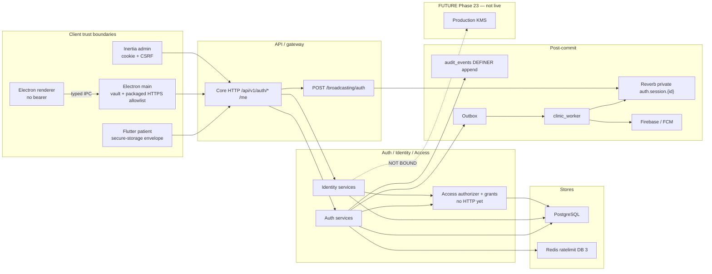

# Threat model — Phase 01 identity and access

Additive to [phase-00-foundation.md](phase-00-foundation.md). Route-level and
non-HTTP catalogs live in [phase-01-entry-points.md](phase-01-entry-points.md).
The Phase 01 DFD is below.

This is a register: assets, actors, preconditions, entry points, attack paths,
impact, implemented mitigation, verification, residual, owner, engineering
status, and independent-acceptance state.

**ENGINEERING STATUS:** engineering draft, repository-complete for HMAC
dual-read/new-write, audited sensitive decrypt, subject erasure, named feature
flags, Firebase/FCM, DFDs, and entry-point catalogs against SHA
`11ffb25c7470c4b42fd535e9780b235de57297e4`.

**INDEPENDENT/HUMAN ACCEPTANCE:** `PENDING_INDEPENDENT_REVIEW`. Assessor and
remediator remain concentrated. Independent re-review remains Phase 22. **Not
a legal, privacy-officer, or statutory position.** Lawful-basis and retention
statutes stay `EXTERNAL_HUMAN` / OPEN.

**G-01-21:** `OPEN` / not PASS because SF-001 remains an unaccepted High
(`PENDING_INDEPENDENT_ACCEPTANCE`).

**National-ID authoritative checksum / legal decision:** deferred per
[ADR 0014](../adr/0014-national-id-check-digit-deferred.md) (`EXTERNAL_HUMAN`).

Do not use `APPROVED` or `ACCEPTED` in this file.

---

## Data-flow diagram — Identity / Auth

KMS is **FUTURE / Phase 23**, not a live processor.

---

## Assets

| Asset | Classification | Store | Trust boundary |
| --- | --- | --- | --- |
| Phone (E.164) | personal | `users.phone_e164_encrypted` + purpose HMAC | Core ↔ PostgreSQL |
| Phone lookup HMAC | internal lookup | `users.phone_lookup_hmac` + `phone_hmac_version` | Core ↔ PostgreSQL |
| National ID | sensitive | envelope + purpose HMAC | Core ↔ PostgreSQL |
| National-ID lookup HMAC | internal lookup | `identity_national_ids` + `hmac_key_version` | Core ↔ PostgreSQL |
| Encrypted identity envelopes | sensitive/credential | AES-GCM `bytea` (phone, national_id, mfa_secret, otp_code, push_token, refresh_replay) | Core ↔ PostgreSQL |
| HMAC / encryption key versions | credential | process env / future KMS; never beside ciphertext | Core ↔ env (**not** live KMS) |
| Password | credential | Argon2id | Core ↔ PostgreSQL |
| OTP code | credential | hash + envelope until purge | Core ↔ worker (handle only on the event) |
| TOTP secret | credential | envelope | Core ↔ PostgreSQL |
| MFA recovery codes | credential | HMAC hashes; plaintext shown once | Client display only |
| Device refresh/access | credential | hashes; client vault/envelope | Electron main / Flutter secure storage |
| Admin cookie session | credential | HTTP-only cookie; hash bound to Laravel session id | Browser ↔ gateway |
| Push device token | credential | `user_devices.push_token_ciphertext`; FCM copy is third-party | Core ↔ Firebase |
| Audit chain | internal | `audit_events` via `clinic_append_audit_event` | App ↔ PostgreSQL |
| Rate-limit counters | internal | Redis DB 3 | App ↔ Redis |
| Session disconnect hint | internal | Redis pub/sub + Reverb private channel | Worker ↔ Reverb |

---

## Preconditions (attacker)

Stolen refresh token; CSRF against an admin cookie; reporter credentials;
compromised Electron renderer; stuffed passwords; reuse of an OTP; AAL1 admin
calling grant/disable/erase/export/recovery-apply; two concurrent
refresh/OTP/grant/audit writes; current-version-only HMAC lookup during
rotation; unaudited decrypt of identity envelopes; erasure of the wrong
subject; feature flags enabled in production by env mistake; FCM payload
enrichment with clinical text.

---

## Named security feature flags

`PlatformFeatures` is the canonical enablement check. Config defaults are
fail-closed (`false`). **When `APP_ENV=production`, registration, recovery, and
profile claim return false even if env vars are true.** Local enablement is
not production state.

| Flag | Purpose | Default (`config` / empty env) | Local (`infra/environments/local.env`) | phpunit | Production / operator expectation | Abuse if mistakenly enabled | Readiness / authorization |
| --- | --- | --- | --- | --- | --- | --- | --- |
| `FEATURE_AUTH_REGISTRATION` | Patient self-registration HTTP | `false` | `true` | `true` | Forced **off** in production until an explicit rollout | Open account creation, OTP spend, National-ID/phone enrolment without operator control | `PlatformFeatures::AUTH_REGISTRATION`; `RegisterAccountService` throws `FeatureUnavailable` |
| `FEATURE_AUTH_RECOVERY` | Account recovery start/complete/apply | `false` | `false` | `true` | Forced **off** in production until owners enable a rollout | Recovery OTP + password reset without the intended cooling-off/operator policy in that environment | `PlatformFeatures::AUTH_RECOVERY`; recovery OTP purpose, `CompleteRecoveryService`, `ApplyRecoveryService` |
| `FEATURE_IDENTITY_PROFILE_CLAIM` | Existing-profile claim OTP purpose | `false` | `false` | `false` | Forced **off** in production; product/privacy/security/support must approve any future enablement | Linking a verified phone to an existing profile without the approved claim ceremony | `PlatformFeatures::IDENTITY_PROFILE_CLAIM`; `profile_claim` OTP purpose is hidden (`FeatureUnavailable` / 404-class) while off |

`.env.example` may set `FEATURE_AUTH_REGISTRATION=true` for local cloning.
That file is not a production inventory.

---

## Firebase / FCM processor

Third-party processor via `kreait/laravel-firebase` (`FirebaseSendPush`
implements `SendPush`). Empty `FIREBASE_CREDENTIALS` binds `DisabledSendPush`
(fail-closed). Inbox rows are the source of truth; push is best-effort after
the database write (`DeliverUserVisibleNotificationService`).

**Actually transmitted on a successful send:**

- device token (plaintext from audited decrypt of
  `user_devices.push_token_ciphertext`, or the token fingerprint argument
  passed into `SendPush::send`)
- lock-screen `title` `Clinic` and `body` `You have a new notice`
- data map: `type` plus **scalar** caller keys only (non-scalars dropped)

Current recovery-notice data keys include `type` and `ref` (request id). Do
not invent clinical fields, `patient_id`, or richer payloads.

**Local lifecycle:** device/account erasure NULLs then DELETEs
`push_token_ciphertext` with the `user_devices` row.

**Residual:** remote FCM token copies, provider invalidation, and provider
retention are `OPERATIONAL_FOLLOW_THROUGH`. This model does not invent Firebase
guarantees or retention periods.

---

## Threat register

Each row includes or clearly references: asset, actor, precondition, entry
point / flow, attack/failure path, impact, implemented mitigation,
verification/evidence, residual, owner, engineering status, independent
acceptance.

### P01-T1 — Refresh reuse / logout gap

| Field | Value |
| --- | --- |
| Asset | Device refresh/access |
| Actor | Stolen-token holder |
| Precondition | Valid refresh in another process |
| Entry point | `POST /api/v1/auth/token/refresh`, logout, session revoke |
| Attack/failure path | Replay of a consumed refresh; logout that leaves the family live |
| Impact | Session takeover |
| Implemented mitigation | Session-linked refresh, consumption ledger, N-2 family revoke, absolute cap |
| Verification | Pest refresh/logout cases; two-connection unique insert |
| Residual | Load-test residual |
| Owner | engineering |
| Engineering status | implemented |
| Independent acceptance | `PENDING_INDEPENDENT_REVIEW` |

### P01-T2 — CSRF / cookie fixation

| Field | Value |
| --- | --- |
| Asset | Admin cookie session |
| Actor | Web attacker with a forged cross-site request |
| Precondition | Victim has an admin cookie or XSRF cookie |
| Entry point | Admin web POST `/login` `/mfa` `/logout`; API routes in `identity.session` |
| Attack/failure path | Cross-site POST; fixation before regenerate |
| Impact | Admin session misuse |
| Implemented mitigation | Bind cookie hash to Laravel session id after regenerate; `ValidateAlwaysCsrf` on web; `ValidateCookieCsrf` when a session/XSRF cookie is present; `CSRF_MISMATCH`; bearer exempt; bare Origin is not CSRF |
| Verification | Pest Origin/cookie cases |
| Residual | Packaged Electron does not send CSRF (device class) |
| Owner | engineering |
| Engineering status | implemented |
| Independent acceptance | `PENDING_INDEPENDENT_REVIEW` |

### P01-T3 — Password/OTP in idempotency hash

| Field | Value |
| --- | --- |
| Asset | Password, OTP, refresh token |
| Actor | Log/store reader |
| Precondition | Idempotency key reused |
| Entry point | Idempotent auth POSTs |
| Attack/failure path | Canonical hash includes secrets → replay or leak |
| Impact | Credential disclosure or stuck replay |
| Implemented mitigation | Canonical hasher strips secrets; refresh replay from device envelope |
| Verification | Unit + feature replay tests |
| Residual | Unkeyed fingerprint of non-secrets |
| Owner | engineering |
| Engineering status | implemented |
| Independent acceptance | `NOT_REQUIRED_FOR_TECHNICAL_CONTROL` |

### P01-T4 — Log/Telescope/Sentry leak

| Field | Value |
| --- | --- |
| Asset | Phone, National ID, OTP, tokens |
| Actor | Operator with sink access |
| Precondition | Auth request logged or reported |
| Entry point | HTTP, jobs, Sentry `before_send` |
| Attack/failure path | Default logger prints bodies |
| Impact | Credential/PII in collectors |
| Implemented mitigation | URI filter, hidden parameters/headers/responses, log taps, Sentry `before_send` |
| Verification | Sink canary tests |
| Residual | Collector-export path still G-07-05 / `OPERATIONAL_FOLLOW_THROUGH` |
| Owner | engineering |
| Engineering status | implemented with export residual |
| Independent acceptance | `OPERATIONAL_FOLLOW_THROUGH` (export evidence) |

### P01-T5 — Auth abuse

| Field | Value |
| --- | --- |
| Asset | Rate-limit counters; OTP budget |
| Actor | Unauthenticated brute-force |
| Precondition | Reachable auth routes |
| Entry point | login, OTP, refresh, MFA, recovery |
| Attack/failure path | Credential stuffing / OTP pumping |
| Impact | Account lockout, SMS cost |
| Implemented mitigation | Named Redis ratelimit store DB 3; layered hits including refresh/MFA |
| Verification | Redis feature test; k6 harness |
| Residual | Adaptive limits absent |
| Owner | engineering |
| Engineering status | implemented |
| Independent acceptance | `PENDING_INDEPENDENT_REVIEW` |

### P01-T6 — Recovery / MFA lifecycle

| Field | Value |
| --- | --- |
| Asset | Password, TOTP secret, recovery codes |
| Actor | Subject or privileged operator |
| Precondition | `FEATURE_AUTH_RECOVERY` enabled in that environment |
| Entry point | recovery start/complete/apply; TOTP enroll/confirm/codes/disable; `identity:bootstrap-admin` |
| Attack/failure path | Immediate privileged recovery; bootstrap URI printed |
| Impact | Account takeover |
| Implemented mitigation | Cooling-off / `manual_review`; operator apply requires `auth.recovery.apply` + admin AAL2; honest `status`; HTTP TOTP; bootstrap URI not printed |
| Verification | Pest recovery/MFA; artisan apply |
| Residual | Legal notice copy `EXTERNAL_HUMAN` |
| Owner | engineering |
| Engineering status | implemented |
| Independent acceptance | `PENDING_INDEPENDENT_REVIEW` |

### P01-T7 — Audit tampering

| Field | Value |
| --- | --- |
| Asset | Audit chain |
| Actor | Compromised `clinic_app` |
| Precondition | Serving-role credentials |
| Entry point | Any audited write; `audit:verify-chain`; `audit:checkpoint-chain` |
| Attack/failure path | UPDATE/DELETE or forged INSERT |
| Impact | Repudiation failure |
| Implemented mitigation | Advisory lock, sequence, actor in hash, DEFINER insert, deny UPDATE/DELETE trigger, verifier command |
| Verification | Privilege tests; verifier; concurrent append |
| Residual | Not a qualified signature |
| Owner | engineering |
| Engineering status | implemented |
| Independent acceptance | `PENDING_INDEPENDENT_REVIEW` |

### P01-T8 — BFLA via grants

| Field | Value |
| --- | --- |
| Asset | Contextual grants |
| Actor | Authenticated user without privilege |
| Precondition | Known grant APIs or service call |
| Entry point | `GrantContextualAccessService` / `RevokeContextualAccessService` (no HTTP) |
| Attack/failure path | Self-issue operator capability; wrong resource |
| Impact | Privilege escalation |
| Implemented mitigation | Initiator `ActorContext`; admin AAL2; grantable allow-list; resource match required |
| Verification | Pest matrix (stale AAL, non-grantable, wrong resource) |
| Residual | Product HTTP UI later |
| Owner | engineering |
| Engineering status | implemented |
| Independent acceptance | `PENDING_INDEPENDENT_REVIEW` |

### P01-T9 — Revoked session stays on Reverb

| Field | Value |
| --- | --- |
| Asset | Session disconnect hint |
| Actor | Holder of a just-revoked socket |
| Precondition | Live Reverb subscription |
| Entry point | `POST /broadcasting/auth`; Reverb WebSocket; logout/revoke |
| Attack/failure path | Channel name guessed; socket lags HTTP deny |
| Impact | Stale realtime after revoke |
| Implemented mitigation | Redis publish + private `session.revoked`; HTTP deny authoritative; channel bound to presenting session row |
| Verification | Measured HTTP deny latency script |
| Residual | Socket-close SLO may stay PARTIAL |
| Owner | engineering |
| Engineering status | implemented |
| Independent acceptance | `NOT_REQUIRED_FOR_TECHNICAL_CONTROL` |

### P01-T10 — Desktop/mobile token theft

| Field | Value |
| --- | --- |
| Asset | Device refresh/access |
| Actor | Local malware / backup reader |
| Precondition | Packaged or mobile client installed |
| Entry point | Electron renderer, main vault, Flutter secure storage |
| Attack/failure path | Renderer reads tokens; runtime URL expands trust; non-atomic vault write |
| Impact | Session theft |
| Implemented mitigation | Packaged custom origin; **baked exact HTTPS allowlist**; runtime `CLINIC_API_BASE_URL` cannot expand trust; renderer does not own bearer; main-process networking; failure-atomic refresh persist; Flutter envelope; logout fail-closed on disk delete |
| Verification | Vitest; packaged WebdriverIO on Ubuntu/Windows/macOS for run **33398311982** / SHA `11ffb25c7470c4b42fd535e9780b235de57297e4` |
| Residual | Signed/notarized installers not claimed; Flutter OS backup ceremony `OPERATIONAL_FOLLOW_THROUGH` |
| Owner | engineering |
| Engineering status | packaged E2E implemented |
| Independent acceptance | `OPERATIONAL_FOLLOW_THROUGH` (signing / mobile OS backup) |

### P01-T11 — Weak keys / cleartext DB

| Field | Value |
| --- | --- |
| Asset | HMAC / encryption key versions; envelopes |
| Actor | Operator with env or DB |
| Precondition | Short keys or `sslmode=prefer` in production |
| Entry point | Readiness; identity crypto ports |
| Attack/failure path | Sub-32-byte keys; cleartext Postgres |
| Impact | Mass identity decrypt |
| Implemented mitigation | 32-byte floor; production SSL mode fail-closed; KMS path documented as future |
| Verification | ConfigurationCheck |
| Residual | Production KMS unimplemented (Phase 23) `OPERATIONAL_FOLLOW_THROUGH` |
| Owner | engineering |
| Engineering status | local/staging binding only |
| Independent acceptance | `OPERATIONAL_FOLLOW_THROUGH` |

### P01-T12 — Reporter reads identity

| Field | Value |
| --- | --- |
| Asset | Phone/National-ID ciphertext |
| Actor | `clinic_reporter` |
| Precondition | Hardening migration applied |
| Entry point | SQL |
| Attack/failure path | SELECT on `users` / OTP tables |
| Impact | PII in reporting |
| Implemented mitigation | Views only after hardening migration |
| Verification | `PostgresPrivilegeTest` + live `clinic` migrate |
| Residual | Unmigrated volumes |
| Owner | engineering |
| Engineering status | implemented |
| Independent acceptance | `NOT_REQUIRED_FOR_TECHNICAL_CONTROL` |

### P01-T13 — HMAC dual-read / new-write rotation lifecycle

| Field | Value |
| --- | --- |
| Asset | Phone lookup HMAC; National-ID lookup HMAC; encrypted identity envelopes; key versions |
| Actor | Operator rotating `IDENTITY_HMAC_VERSION` / encryption version; attacker racing registration during rotation |
| Precondition | Mixed v1/v2 rows; current version advanced |
| Entry point | Identity lookups (`findByPhoneHmacs`, National-ID uniqueness); `POST /api/v1/auth/registrations`; `identity:rotate-keys` |
| Attack/failure path | Current-version-only lookup during v1→v2 makes old identities invisible or allows a duplicate create for the same phone/National ID |
| Impact | Account orphaning, duplicate identity, failed login/OTP for rotated subjects |
| Implemented mitigation | Reads calculate **all configured readable** lookup digests (`lookupDigests` / `phoneLookupHmacs` / `nationalIdLookupHmacs`). Writes use **only the current** HMAC version. Mixed v1/v2 data remains readable. Rotation is batched, resumable via version columns, idempotent on already-current rows. Explicit retirement gate (`--status` / `retirement_safe`). Short-lived old OTP and refresh-replay envelopes are **not** rewritten and **block retirement** until expiry/prune. The old key is **never automatically deleted**. Closed (tombstone) users are skipped. |
| Verification | ADR 0013; `IdentityKeyLifecycleTest`; `identity:rotate-keys` inspect/apply |
| Residual | Live production KMS provider/binding/ceremony is Phase 23 / `OPERATIONAL_FOLLOW_THROUGH`. Provider/account approval is `EXTERNAL_HUMAN`. Do not claim live KMS. |
| Owner | engineering |
| Engineering status | implemented (application keys; not KMS) |
| Independent acceptance | `OPERATIONAL_FOLLOW_THROUGH` (KMS); `EXTERNAL_HUMAN` (provider approval) |

### P01-T14 — Audited sensitive decrypt bypass

| Field | Value |
| --- | --- |
| Asset | Phone, National ID, OTP, TOTP seed, push token |
| Actor | Application path that needs plaintext; insider reading audit |
| Precondition | Envelope available to Core |
| Entry point | `AuditedSensitiveDecryptor`; audit event `auth.sensitive_decrypt` |
| Attack/failure path | Sensitive plaintext use bypasses audit/logging, or audit rows contain secrets |
| Impact | Untracked disclosure or secret-in-logs |
| Implemented mitigation | Approved sensitive plaintext use goes through `AuditedSensitiveDecryptor` with safe metadata (purpose, decrypt class, reason code, object id, actor, key version, correlation id). Classes: `internal_processing` vs `human_disclosure`. **Every current product purpose is `internal_processing` and is still audited**, including OTP delivery (`otp_delivery_code`, `otp_delivery_destination`), TOTP verify/confirm/disable/replace/bootstrap, recovery notice (`phone_recovery_notice`), push-token delivery, and key rotation (phone, National ID, TOTP, push token). `human_disclosure` is reserved; support screens never receive plaintext National ID or full phone. Internal OTP processing is still audited. AES-GCM itself is not audited recursively. Refresh-replay decrypt stays on `FieldEncryptor` as a short-lived credential envelope, not an identity plaintext disclosure. **Audit events do not contain** phone plaintext, National ID, OTP, TOTP seed, key material, or bearer/refresh tokens. Do **not** claim every raw AES decrypt is a human disclosure event. |
| Verification | `IdentityKeyLifecycleTest` OTP/TOTP audit cases; ADR 0013 |
| Residual | Compromised process can still decrypt if keys are in env |
| Owner | engineering |
| Engineering status | implemented |
| Independent acceptance | `PENDING_INDEPENDENT_REVIEW` |

### P01-T15 — Subject erasure isolation and leftovers

| Field | Value |
| --- | --- |
| Asset | Live Phase-01 identity/auth state |
| Actor | Privileged operator (`identity.erase`, admin AAL2) or buggy job |
| Precondition | Two subjects exist; operator authorized |
| Entry point | `EraseSubjectService` + `Phase01SubjectHoldings` (no HTTP). Enumeration via `ExportSubjectDataService` (`identity.export`, no HTTP). |
| Attack/failure path | Live identity/auth state survives account erasure, or one user's cleanup affects another user |
| Impact | Residual PII; cross-subject destruction |
| Implemented mitigation | Per-holding actions: `DELETE`, `IRREVERSIBLE_TOMBSTONE`, `HMAC_LOOKUP_TOMBSTONE`, `PRESERVE_SECURITY_AUDIT`, `NOT_SUBJECT_LINKED`. National IDs and profile links deleted. Sessions, devices, refresh consumptions, MFA factors/codes/challenges, recovery requests, OTP rows, contextual grants (actor or resource), notifications, Laravel `sessions`, pending/failed User/AuthSession outbox, and identifiable rate-limit keys cleaned. User row is FK-safe irreversible tombstone (name/phone ciphertext/HMAC/credential digest overwritten; status closed). Audit chain preserved (`identity.subject_erased` appended; rows not rewritten). Two-subject isolation covered by `EraseSubjectServiceTest`. Export enumeration shares the holdings plan. |
| Verification | `EraseSubjectServiceTest`; data inventory; deletion-and-purge doc |
| Residual | Historical backups are **not** rewritten. FCM remote/provider retention = `OPERATIONAL_FOLLOW_THROUGH`. Offline Flutter/Electron copies = `OPERATIONAL_FOLLOW_THROUGH`. Statutory lawful basis / retention / audit-erasure legality = `EXTERNAL_HUMAN`. No Egyptian statutory periods or articles are asserted. |
| Owner | engineering |
| Engineering status | implemented for live Phase-01 state |
| Independent acceptance | `EXTERNAL_HUMAN` (legal); `OPERATIONAL_FOLLOW_THROUGH` (backups/FCM/clients) |

### P01-T16 — Firebase/FCM data-flow overshare

| Field | Value |
| --- | --- |
| Asset | Push device token; notification content |
| Actor | Google FCM as processor; compromised worker |
| Precondition | Push adapter enabled (`FIREBASE_CREDENTIALS` present) |
| Entry point | `FirebaseSendPush`; recovery-notice consumer; `DeliverUserVisibleNotificationService` |
| Attack/failure path | Clinical text or identifiers in lock-screen/data; token left at provider after erasure |
| Impact | Third-party processing of excess personal data |
| Implemented mitigation | Generic lock-screen copy only; scalar data keys; inbox-first; local token deleted with device/account lifecycle |
| Verification | `FirebaseSendPushAdapterTest`; data inventory Firebase section |
| Residual | Remote provider retention/invalidation = `OPERATIONAL_FOLLOW_THROUGH` |
| Owner | engineering |
| Engineering status | implemented locally |
| Independent acceptance | `OPERATIONAL_FOLLOW_THROUGH` |

### P01-T17 — Feature-flag misenablement

| Field | Value |
| --- | --- |
| Asset | Registration, recovery, profile-claim surfaces |
| Actor | Operator setting env in production |
| Precondition | `APP_ENV=production` or a local flag copied to prod |
| Entry point | `FEATURE_AUTH_*` / `FEATURE_IDENTITY_PROFILE_CLAIM` |
| Attack/failure path | Local `FEATURE_AUTH_REGISTRATION=true` treated as production policy |
| Impact | Unapproved self-registration or recovery in production |
| Implemented mitigation | `PlatformFeatures` forces the three flags **false** when `app.env === production`. Defaults false. Profile claim off in local and phpunit. Recovery off in local.env; on in phpunit only. |
| Verification | Platform feature tests; IdentityAccessPortsTest claim-off case |
| Residual | Non-production environments can enable registration; that is not production |
| Owner | engineering |
| Engineering status | implemented |
| Independent acceptance | `EXTERNAL_HUMAN` (production rollout decision) |

---

## Boundary notes (Phase 01)

- **Admin cookie:** hash is `hmac(cookie:<laravel session id>)` after
  `session()->regenerate()`.
- **Device clients:** CSRF is not inferred from a client-supplied
  `client_class`. A bare Origin without a session cookie is treated as a
  non-browser device call.
- **Privileged TOTP:** admin/doctor/pharmacy/secretary recovery stays
  `manual_review` until an AAL2 operator applies it. Patients follow cooling-off
  unless the configured delay is 0.
- **National ID check-digit:** not implemented
  ([ADR 0014](../adr/0014-national-id-check-digit-deferred.md)). Legal decision
  `EXTERNAL_HUMAN`.
- **Access HTTP:** grant issue/revoke, identity disable/erase/export have **no**
  Phase 01 HTTP routes. They are service entry points in
  [phase-01-entry-points.md](phase-01-entry-points.md).
- **Worker OTP rights:** `clinic_worker` has `SELECT, UPDATE` on the full
  `otp_requests` table, not a single delivery column. See Phase 00 Boundary 3.

Privacy: phones and National IDs are personal/sensitive. Retention periods in
the inventory are **engineering defaults**, not a legal schedule.

---

## Implemented vs future (Phase 01)

| Topic | State |
| --- | --- |
| Production KMS provider | NOT live — Phase 23 / `OPERATIONAL_FOLLOW_THROUGH` |
| Production TLS ceremony | NOT live |
| Successful staging | NOT executed |
| Production promotion | NOT executed |
| Encrypted backup restore drill | NOT executed |
| Independent legal/privacy approval | `EXTERNAL_HUMAN` |
| Phase 02+ clinical data | NOT in this model as current flows |
| Live AI provider / cross-border | NOT active |

---

## Summary table

| ID | Threat | Engineering status | Independent acceptance |
| --- | --- | --- | --- |
| P01-T1 | Refresh reuse | implemented | `PENDING_INDEPENDENT_REVIEW` |
| P01-T2 | CSRF / cookie | implemented | `PENDING_INDEPENDENT_REVIEW` |
| P01-T3 | Idempotency secrets | implemented | `NOT_REQUIRED_FOR_TECHNICAL_CONTROL` |
| P01-T4 | Log leak | implemented; export residual | `OPERATIONAL_FOLLOW_THROUGH` |
| P01-T5 | Auth abuse | implemented | `PENDING_INDEPENDENT_REVIEW` |
| P01-T6 | Recovery / MFA | implemented | `PENDING_INDEPENDENT_REVIEW` |
| P01-T7 | Audit tampering | implemented | `PENDING_INDEPENDENT_REVIEW` |
| P01-T8 | BFLA grants | implemented | `PENDING_INDEPENDENT_REVIEW` |
| P01-T9 | Reverb revoke | implemented | `NOT_REQUIRED_FOR_TECHNICAL_CONTROL` |
| P01-T10 | Desktop/mobile theft | packaged E2E PASS on current SHA | `OPERATIONAL_FOLLOW_THROUGH` |
| P01-T11 | Weak keys | local keys only | `OPERATIONAL_FOLLOW_THROUGH` |
| P01-T12 | Reporter SELECT | implemented | `NOT_REQUIRED_FOR_TECHNICAL_CONTROL` |
| P01-T13 | HMAC rotation | implemented; no live KMS | `OPERATIONAL_FOLLOW_THROUGH` / `EXTERNAL_HUMAN` |
| P01-T14 | Audited decrypt | implemented | `PENDING_INDEPENDENT_REVIEW` |
| P01-T15 | Subject erasure | live Phase-01 state | `EXTERNAL_HUMAN` / `OPERATIONAL_FOLLOW_THROUGH` |
| P01-T16 | Firebase/FCM | local send path | `OPERATIONAL_FOLLOW_THROUGH` |
| P01-T17 | Feature flags | production forced off | `EXTERNAL_HUMAN` |
