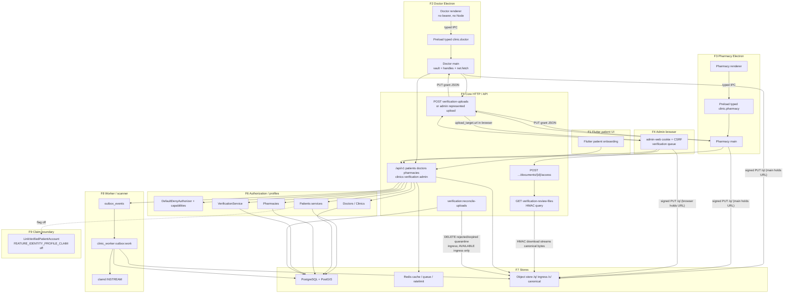

# Threat model — Phase 02 onboarding, verification, profiles, and locations

Additive to [phase-00-foundation.md](phase-00-foundation.md) and
[phase-01-identity.md](phase-01-identity.md). Route-level, IPC, job, storage,
and scanner catalogs live in
[phase-02-entry-points.md](phase-02-entry-points.md).

This is a register: assets, actors, preconditions, entry points, attack
paths, impact, implemented mitigation, verification/evidence, residual,
owner, engineering status, independent-acceptance state, and an explicit
**Status** of `MITIGATED`, `PARTIAL`, `OPEN`, or `NOT_APPLICABLE`.

**ENGINEERING STATUS:** original P02-AUDIT-004 engineering draft against
starting main `d16fcde5b07844f69547a7ed7be52187a44800d8`. Subsequent
**QA-P02A003-014** evidence reconciliation of P02-T45 against main
`8083ad0c85ce60a0346910416a83472861d971ca` after the merged profile-correction
policy v1.0.2. A later closure-consistency pointer records current linked
authority for P02-T49 (live `SF-001.json` / P02-AUDIT-006 `CLOSED`) without
changing this register's P02-T49 Status `OPEN`. This is **not** independent
human approval and does **not** recast this file as a new original
P02-AUDIT-004 closer.

**INDEPENDENT/HUMAN ACCEPTANCE:** `PENDING_INDEPENDENT_REVIEW`. Assessor and
remediator remain concentrated. Independent workshop/sign-off remains Phase 00
**G-08-04 / EXTERNAL_HUMAN** and Phase 22. **Not a legal, privacy-officer, or
statutory position.**

Do not use `APPROVED` or `ACCEPTED` as independent-acceptance vocabulary in
this file. Do not convert plans into mitigations. Do not claim P02-AUDIT-003
**CLOSED**: the missing-policy condition on P02-T45 is resolved by merged
v1.0.2 Freeze Current Behavior, and P02-AUDIT-003 is `READY_FOR_RE_QA`
pending independent QA of this QA-P02A003-014 reconciliation. Document-requirement
catalogue v1.0.1 is installed and tested; that is not this threat-model gate
and is not G-08-04.

**SF-001:** `OPEN / UNCHANGED` (`extract-zip@2.0.1`, merge-only,
`promotion_allowed: false`). Not remediated here.

**G-08-04:** `OPEN` / `EXTERNAL_HUMAN`. AI/agent threat-model work is
engineering evidence, not independent human approval.

**P02-AUDIT-005** (profile-claim enablement) is **out of scope**. Claim remains
flag-off; see P02-T46.

---

## Methodology

STRIDE plus privacy analysis across the Phase 02 trust boundaries that are
actually implemented. For each threat: asset/flow, attacker, STRIDE/privacy
category, abuse scenario, existing control, evidence, residual, status,
owner.

Method matches Phase 00/01: what crosses the boundary, what an attacker would
try, what stops them **today**, and what does not. `MITIGATED` requires a
named source file **and** a named test/contract/CI artifact. “Code appears
safe” is not evidence.

ISR-016 repository completeness for this phase is the structural parser in
`apps/core-api/tests/Support/ThreatModel/` plus
`apps/core-api/tests/Feature/Platform/ThreatModelDocumentationTest.php`.
Substring presence of an ID is not completeness. Independent workshop remains
G-08-04.

---

## Independent-acceptance vocabulary

Same register as Phase 00/01:

| Value | Meaning |
| --- | --- |
| `NOT_REQUIRED_FOR_TECHNICAL_CONTROL` | Engineering control with no separate human acceptance gate |
| `PENDING_INDEPENDENT_REVIEW` | Technical model exists; independent workshop/sign-off has not occurred |
| `PENDING_INDEPENDENT_ACCEPTANCE` | Exception or High finding still needs an independent acceptor |
| `EXTERNAL_HUMAN` | Legal, privacy-officer, CODEOWNER-team, or G-08-04 decision |
| `OPERATIONAL_FOLLOW_THROUGH` | Live ceremony, staging, promotion, or provider operations not executed |

---

## Current vs future (do not convert plans into mitigations)

**Implemented now:** patient/doctor/pharmacy onboarding HTTP; verification
cases, uploads, scan, reviewer HMAC download; admin queue/claim/decide;
clinic locations + staff; pharmacy branches + memberships; Electron opaque
file handles; Flutter patient onboarding against generated Dart; source-built
MinIO CI from merged PR #30; Product/Security/Privacy profile-correction
policy evidence v1.0.2 Freeze Current Behavior (P02-T45; evidence-only,
runtime unchanged).

**NOT implemented / NOT live / NOT claimed:**

- `FEATURE_IDENTITY_PROFILE_CLAIM` production/local enablement (P02-AUDIT-005)
- dual-approval for high-risk exceptions (optional in the phase text; **not
  configured** in policy v1.0.1 — P02-T47 NOT_APPLICABLE until a future
  policy adds that category)
- appeal HTTP
- public directory / public PostGIS search
- Inertia admin verification pages (admin is `apps/admin-web`)
- production KMS; successful staging deploy; production promotion
- independent legal/privacy approval (`EXTERNAL_HUMAN`)
- automated government/syndicate/license verification
- clinical records (Phase 04+)

---

## Data-flow diagram — Phase 02

KMS is **FUTURE / Phase 23**, not a live processor. Reviewer download is an
application HMAC, not an S3 GET. There is **no** S3 event-notification
webhook; the worker pulls bytes and clamd INSTREAM.

The upload trust boundary is **not** “client → API → object store” for the
bytes. The API issues a PUT grant. The component that **possesses the signed
URL** then PUTs directly:

- Doctor/Pharmacy Electron: **main process** holds the signed URL and streams
  the opaque handle. The renderer never receives `upload_target`.
- Admin represented-applicant upload: the **admin browser** holds
  `upload_target.url` and performs the signed PUT.

Trust-boundary / data-flow inventory (17):

1. Flutter patient → API
2. Doctor renderer → preload → main → API
3. Pharmacy renderer → preload → main → API
4. Admin browser → API
5. API → PostgreSQL/PostGIS
6. API/worker → Redis/queue
7. API/worker → object storage (grants, metadata, worker copy/observe)
8. Worker → malware scanner (clamd INSTREAM; no inbound scanner HTTP)
9. Applicant → upload pipeline (grant → complete → outbox → scan)
10. Verifier → case projection + HMAC document-access grant → HMAC download endpoint → object-store retrieval
11. Profile/membership authorization (`DefaultDenyAuthorizer`)
12. Location/PostGIS (own-doctor / own-org only; no public search)
13. Account → profile claim (`LinkVerifiedPatientAccount`, flag off)
14. Doctor/Pharmacy Electron main → direct signed PUT to object storage (main possesses the signed URL)
15. Admin browser represented upload → direct signed PUT to object storage (browser possesses the signed URL)
16. HMAC reviewer-download endpoint → canonical object-store GET (application HMAC, not S3 `temporaryUrl`)
17. `verification:reconcile-uploads` → upload-intent rows → object-store DELETE for rejected/expired quarantine objects (and expired AVAILABLE **ingress only**)

---

## Actors (19)

Human roles plus non-human threat principals that actually touch Phase 02
boundaries. Rows marked “trust-boundary principal” are not interactive
product roles; they are still attackers/principals in the register.

| Actor | Notes |
| --- | --- |
| patient | Authenticated Flutter; own profile only |
| doctor applicant | Draft/pending/changes_requested/rejected; no clinical capability |
| approved doctor | Location/staff after approval |
| pharmacy owner/applicant | Org onboarding + verification |
| pharmacy member/operator | Branch-scoped membership |
| clinic secretary/staff | Location-scoped membership |
| admin verifier | AAL2 + `verification.case.review`; no clinical module |
| admin acting on an applicant's behalf | Represented-doctor create/upload/submit (`doctors.admin.create`); not the assigned reviewer of that case |
| staff invitee | Clinic secretary / pharmacy operator accepting an invitation |
| malicious authenticated user | Cross-object IDOR/BFLA |
| anonymous caller | Unauthenticated HTTP against onboarding/reviewer-download/public probes |
| compromised renderer/client | XSS in Electron renderer or stolen SPA |
| malicious uploaded document | MIME/polyglot/malware/bomb |
| insider/reviewer | Need-to-know browsing, notes, bulk access |
| background worker/service | `clinic_worker`; confused deputy |
| external object-storage/scanner boundary | MinIO/S3 + clamd (trust-boundary principal) |
| log-sink/operator boundary | Operators with log/event/export access (trust-boundary principal, not a product role) |
| supply-chain attacker | Compromised desktop/CI dependency (SF-001 / extract-zip); trust-boundary principal |
| direct database reader | Stolen replica / excessive DB role; HMAC/ciphertext offline abuse (trust-boundary principal) |

---

## Assets (23)

Invitation phone material is grouped: invitation rows store a **blind index
only**. They do **not** persist invitee phone ciphertext.

| Asset | Classification | Store | Trust boundary |
| --- | --- | --- | --- |
| Patient demographic profile | personal | `patient_profiles` + revisions | API ↔ PostgreSQL |
| National ID ciphertext | sensitive | patient/doctor envelopes | API ↔ PostgreSQL |
| National ID lookup HMAC | internal lookup | `national_id_lookup_hmac` | API ↔ PostgreSQL |
| Doctor professional identity | personal/professional | `doctor_profiles` | API ↔ PostgreSQL |
| Pharmacy legal identity | personal/org | org ciphertext + registration HMAC | API ↔ PostgreSQL |
| Verification cases | internal workflow | `verification_cases` | API ↔ PostgreSQL |
| Verification documents | sensitive file metadata | `verification_documents` + object bytes | API/worker ↔ S3 |
| Reviewer decisions/notes | sensitive (notes encrypted) | `verification_decisions.notes_ciphertext` | API ↔ PostgreSQL |
| Specialties | internal reference | `specialties` seed | API ↔ PostgreSQL |
| Clinic locations | location | `clinic_locations` address ciphertext + geography | API ↔ PostGIS |
| Pharmacy organizations/branches | org/location | pharmacy tables + geography | API ↔ PostGIS |
| Memberships | authorization | clinic/pharmacy memberships | API ↔ PostgreSQL |
| Account/profile links | identity | `patient_profiles.user_id` (claim flag off) | API ↔ PostgreSQL |
| Audit records | internal | `audit_events` DEFINER append | API ↔ PostgreSQL |
| Object-store data | sensitive bytes | `/q/` quarantine, `/c/` canonical | worker ↔ S3 |
| Upload handles/grants | credential | intent row + signed PUT; Electron opaque handle | client ↔ API ↔ S3 |
| Location/address data | personal/location | address ciphertext; public_name | API ↔ PostgreSQL |
| Worker DB identity | credential | `clinic_worker` role | worker ↔ PostgreSQL |
| Staff invitation phone ciphertext | sensitive / **not on invitation rows** | Invitee `users.phone_e164_encrypted` only; clinic/pharmacy invitation tables store **no** phone ciphertext by design | API ↔ PostgreSQL |
| Staff invitation phone blind index | internal lookup | `clinic_staff_invitations.target_phone_lookup_hmac` and `pharmacy_staff_invitations.target_phone_lookup_hmac` | API ↔ PostgreSQL |
| `clinic_staff_profiles` | identity | secretary profile row linked to `user_id` | API ↔ PostgreSQL |
| Reviewer-download signing key | credential | `ReviewerDocumentUrlSigner` uses `config('app.key')` HMAC secret | API process |
| Idempotency records | internal | `idempotency_keys` (onboarding/upload/decide replay) | API ↔ PostgreSQL |

---

## Preconditions (attacker)

Stolen bearer; CSRF against admin cookie; stolen reviewer HMAC URL; guessed
UUIDv7; mass-assigned `verification_status`; MIME/extension lie; renderer XSS;
forged IPC sender; stale evidence handle; replayed complete; scanner down;
worker confused deputy; concurrent same-NID onboarding; stale membership after
revoke; insider with AAL2; claim flag mistakenly enabled.

---

## Threat register

### P02-T01 — Duplicate patient/profile creation

| Field | Value |
| --- | --- |
| Asset / flow | Patient/doctor/pharmacy identity; F1/F5/F7 |
| Attacker | Two concurrent users or racing walk-in vs onboarding |
| STRIDE / privacy | Tampering / Information disclosure |
| Abuse scenario | Two authoritative profiles for one National ID or registration HMAC |
| Existing control | Unique `national_id_lookup_hmac` / registration HMAC; row lock; loser → `manual_review_required` without disclosure |
| Evidence | `PatientProfileRaceTest`; `DoctorProfileRaceTest`; `PharmacyOrganizationRaceTest`; `AdminCreatedDoctorRaceTest` |
| Residual | Claim attach still off (P02-T46) |
| Status | **MITIGATED** |
| Owner | engineering |
| Engineering status | implemented |
| Independent acceptance | `PENDING_INDEPENDENT_REVIEW` |

### P02-T02 — Account/profile takeover

| Field | Value |
| --- | --- |
| Asset / flow | Account → profile link; F13 |
| Attacker | Authenticated user submitting another subject’s National ID |
| STRIDE / privacy | Elevation / Information disclosure |
| Abuse scenario | Steal or switch an owned profile by repeating the identifier |
| Existing control | Collision does not attach or disclose; owned row unchanged; claim service unavailable while flag off |
| Evidence | `PatientProfileFlowsTest` owned-NID collision; `DoctorProfileFlowsTest`; `PharmacyOrganizationFlowsTest`; `IdentityAccessPortsTest` `FeatureUnavailable` |
| Residual | Enablement of claim is P02-AUDIT-005 |
| Status | **MITIGATED** |
| Owner | engineering |
| Independent acceptance | `PENDING_INDEPENDENT_REVIEW` |

### P02-T03 — National ID enumeration

| Field | Value |
| --- | --- |
| Asset / flow | National ID; F1/F5 |
| Attacker | Authenticated or unauthenticated probe |
| STRIDE / privacy | Information disclosure |
| Abuse scenario | Existence oracle via distinct error codes or leaked HMAC/plaintext |
| Existing control | Generic `manual_review_required`; registration-bound National ID comparison (`CreatePatientProfile` `matchesBoundIdentity` against the account `national_id_lookup_hmac`); no `patient_id` on collision; no public resolve HTTP; events/logs omit NID |
| Evidence | `PatientProfileFlowsTest` non-disclosure; `RedactionCanaryTest`; chunk-01 canary sinks |
| Residual | Timing side-channel not load-tested here |
| Status | **MITIGATED** |
| Owner | engineering |
| Independent acceptance | `PENDING_INDEPENDENT_REVIEW` |

### P02-T04 — Blind-index abuse

| Field | Value |
| --- | --- |
| Asset / flow | National ID / registration HMAC |
| Attacker | DB reader or caller stuffing HMAC bytes |
| STRIDE / privacy | Information disclosure / Tampering |
| Abuse scenario | Client-supplied HMAC; offline dictionary against lookup column |
| Existing control | Server computes HMAC; mass-assignment of HMAC rejected; purpose-bound keys; dual-read lifecycle is Phase 01 P01-T13 |
| Evidence | `DoctorProfileFlowsTest` / `AdminCreatedDoctorHttpTest` reject HMAC fields; `IdentityKeyLifecycleTest` |
| Residual | HMAC is still a keyed index, not anonymity |
| Status | **MITIGATED** |
| Owner | engineering |
| Independent acceptance | `PENDING_INDEPENDENT_REVIEW` |

### P02-T05 — Mass assignment

| Field | Value |
| --- | --- |
| Asset / flow | verification_status, capabilities, ciphertext, reviewer_id |
| Attacker | Applicant or admin posting extra JSON |
| STRIDE / privacy | Elevation |
| Abuse scenario | Set `verification_status=approved` or inject object keys |
| Existing control | Strict Form Requests / unknown-field 422; server-owned columns not fillable |
| Evidence | `VerificationFlowsTest`; `PharmacyVerificationFlowsTest`; `DoctorProfileFlowsTest`; `AdminCreatedDoctorHttpTest`; `ClinicLocationFlowsTest`; `VerificationUploadFlowsTest` complete extras |
| Residual | None material |
| Status | **MITIGATED** |
| Owner | engineering |
| Independent acceptance | `NOT_REQUIRED_FOR_TECHNICAL_CONTROL` |

### P02-T06 — BOLA / IDOR

| Field | Value |
| --- | --- |
| Asset / flow | Cases, uploads, profiles, locations, memberships |
| Attacker | Malicious authenticated user |
| STRIDE / privacy | Information disclosure / Elevation |
| Abuse scenario | Guess UUID of another actor’s case/upload/location |
| Existing control | Own-status only; invented lookup routes 404; upload owner check |
| Evidence | `VerificationFlowsTest` other-doctor; `VerificationUploadFlowsTest`; `PharmacyVerificationFlowsTest`; `PatientProfileFlowsTest`; `BearerIdentitySessionHttpTest` |
| Residual | UUIDv7 not a secret; 404 vs 403 may still be a coarse oracle |
| Status | **MITIGATED** |
| Owner | engineering |
| Independent acceptance | `PENDING_INDEPENDENT_REVIEW` |

### P02-T07 — BFLA

| Field | Value |
| --- | --- |
| Asset / flow | `verification.case.review`; admin create |
| Attacker | Doctor/pharmacy with extra caps or AAL1 admin |
| STRIDE / privacy | Elevation |
| Abuse scenario | Call admin queue/decide without privileged AAL2 |
| Existing control | `DefaultDenyAuthorizer`; AAL2 required; applicant capabilities cannot review |
| Evidence | `IdentityRulesTest`; `VerificationPolicyV1HttpTest` AAL1 claim 404; `VerificationFlowsTest` unauthorized reviewer |
| Residual | None material |
| Status | **MITIGATED** |
| Owner | engineering |
| Independent acceptance | `PENDING_INDEPENDENT_REVIEW` |

### P02-T08 — Cross-profile access

| Field | Value |
| --- | --- |
| Asset / flow | Patient/doctor own projections |
| Attacker | Other authenticated user |
| STRIDE / privacy | Information disclosure |
| Abuse scenario | `GET /patients/{id}` or other user’s `/me` |
| Existing control | `/me` only; other-id routes 404 |
| Evidence | `PatientProfileFlowsTest`; `DoctorProfileFlowsTest` |
| Residual | None material |
| Status | **MITIGATED** |
| Owner | engineering |
| Independent acceptance | `PENDING_INDEPENDENT_REVIEW` |

### P02-T09 — Cross-clinic access

| Field | Value |
| --- | --- |
| Asset / flow | Clinic locations / memberships |
| Attacker | Doctor B |
| STRIDE / privacy | Information disclosure / Tampering |
| Abuse scenario | Read/patch/invite on doctor A location |
| Existing control | Owner scope; 404 on foreign ids |
| Evidence | `ClinicLocationFlowsTest`; `ClinicStaffInvitationFlowsTest`; desktop `PracticeLocations.test.tsx` |
| Residual | No public clinic search (reduces exposure) |
| Status | **MITIGATED** |
| Owner | engineering |
| Independent acceptance | `PENDING_INDEPENDENT_REVIEW` |

### P02-T10 — Cross-pharmacy organization/branch access

| Field | Value |
| --- | --- |
| Asset / flow | Org/branch/membership |
| Attacker | Owner/operator of org B |
| STRIDE / privacy | Information disclosure / Tampering |
| Abuse scenario | Invite/list/revoke on org A; mix org A + branch B FK |
| Existing control | Org-scoped services; composite FK 23503 |
| Evidence | `PharmacyStaffInvitationFlowsTest` BOLA + FK; `PharmacyAdditionalBranchFlowsTest` |
| Residual | None material |
| Status | **MITIGATED** |
| Owner | engineering |
| Independent acceptance | `PENDING_INDEPENDENT_REVIEW` |

### P02-T11 — Membership escalation

| Field | Value |
| --- | --- |
| Asset / flow | clinic/pharmacy memberships |
| Attacker | Invitee or revoked member |
| STRIDE / privacy | Elevation |
| Abuse scenario | Self-invite as owner; accept foreign invitation; keep owner after revoke |
| Existing control | Invite capability on owner; accept own invitation; unique active membership; revoke status |
| Evidence | `PharmacyStaffInvitationFlowsTest`; `ClinicStaffInvitationFlowsTest`; race tests |
| Residual | See P02-T12 for token-lifetime after revoke |
| Status | **MITIGATED** |
| Owner | engineering |
| Independent acceptance | `PENDING_INDEPENDENT_REVIEW` |

### P02-T12 — Stale membership/capability caches

| Field | Value |
| --- | --- |
| Asset / flow | Effective capabilities after revoke; F6/F11 |
| Attacker | Just-revoked operator with a live bearer |
| STRIDE / privacy | Elevation |
| Abuse scenario | Cached capability still authorizes branch write |
| Existing control | Server re-checks membership on command; contextual grant revoke is tested; HTTP deny is authoritative |
| Evidence | `GrantValidityWindowTest`; membership revoke flows. **No** dedicated test that a revoked pharmacy/clinic member’s **same bearer** is denied on a privileged Phase 02 write via a stale cache |
| Residual | Session token reuse after membership revoke is thinner than grant-revoke coverage |
| Status | **PARTIAL** |
| Owner | engineering |
| Independent acceptance | `PENDING_INDEPENDENT_REVIEW` |

### P02-T13 — Self-review

| Field | Value |
| --- | --- |
| Asset / flow | verification decisions |
| Attacker | Applicant who also holds admin caps |
| STRIDE / privacy | Elevation / Repudiation |
| Abuse scenario | Approve own doctor/pharmacy case |
| Existing control | Applicant id ≠ reviewer; denied even with privileged capabilities |
| Evidence | `VerificationFlowsTest`; `PharmacyVerificationFlowsTest`; `AdminVerificationReviewHttpTest`; `AdminPharmacyVerificationReviewHttpTest` |
| Residual | None material |
| Status | **MITIGATED** |
| Owner | engineering |
| Independent acceptance | `PENDING_INDEPENDENT_REVIEW` |

### P02-T14 — Creator-review (represented applicant)

| Field | Value |
| --- | --- |
| Asset / flow | Admin-created doctor |
| Attacker | Creating admin |
| STRIDE / privacy | Elevation |
| Abuse scenario | Same admin claims/decides the represented case |
| Existing control | Creating admin cannot claim/decide; other admin cannot upload/submit that applicant |
| Evidence | `AdminCreatedDoctorHttpTest`; `VerificationPolicyV1HttpTest`; Playwright `admin-created-doctor.spec.ts` |
| Residual | Dual-approval remains NOT_APPLICABLE while policy v1.0.1 has no high-risk category (P02-T47) |
| Status | **MITIGATED** |
| Owner | engineering |
| Independent acceptance | `PENDING_INDEPENDENT_REVIEW` |

### P02-T15 — Reviewer privilege escalation

| Field | Value |
| --- | --- |
| Asset / flow | `doctors.admin.create` / review |
| Attacker | AAL1 admin or non-admin |
| STRIDE / privacy | Elevation |
| Abuse scenario | Create represented doctor or review without AAL2 |
| Existing control | Privileged AAL2 + named capabilities |
| Evidence | `IdentityRulesTest`; `VerificationPolicyV1HttpTest` |
| Residual | None material |
| Status | **MITIGATED** |
| Owner | engineering |
| Independent acceptance | `PENDING_INDEPENDENT_REVIEW` |

### P02-T16 — Reviewer clinical-data overreach

| Field | Value |
| --- | --- |
| Asset / flow | Admin verification projection |
| Attacker | Admin verifier |
| STRIDE / privacy | Information disclosure / privacy |
| Abuse scenario | Join medical records or global patient search from verification UI/API |
| Existing control | Admin DTOs are verification/profile fields only; Verification cannot query clinical modules; no clinical routes in Phase 02; architecture boundary tests |
| Evidence | `ArchitectureBoundaryTest`; `AdminVerificationReviewHttpTest` field allowlist; Playwright queue; phase non-goals (no medical record) |
| Residual | Later clinical phases must not add joins; independent privacy review is G-08-04 |
| Status | **MITIGATED** |
| Owner | engineering |
| Independent acceptance | `PENDING_INDEPENDENT_REVIEW` |

### P02-T17 — Verification status forgery

| Field | Value |
| --- | --- |
| Asset / flow | `doctor_profiles.verification_status` |
| Attacker | Applicant posting status or forging events |
| STRIDE / privacy | Tampering / Spoofing |
| Abuse scenario | Direct status field or event replay to `approved` |
| Existing control | Transitions only via `VerificationService::recordDecision`; mass-assign 422; pending has no clinical capability |
| Evidence | Mass-assignment tests; capability tests in doctor/pharmacy flows; `ArchitectureBoundaryTest` |
| Residual | None material |
| Status | **MITIGATED** |
| Owner | engineering |
| Independent acceptance | `PENDING_INDEPENDENT_REVIEW` |

### P02-T18 — Verification decision replay

| Field | Value |
| --- | --- |
| Asset / flow | Decide HTTP |
| Attacker | Reviewer or thief replaying idempotent decide |
| STRIDE / privacy | Tampering |
| Abuse scenario | Replay approve after reject or double-decide |
| Existing control | Idempotency keys; case version; assigned reviewer; concurrent claim/decide races converge to one winner |
| Evidence | `VerificationRaceTest`; `PharmacyVerificationRaceTest`; `AdminVerificationClaimRaceTest`; decide idempotency in HTTP tests |
| Residual | None material |
| Status | **MITIGATED** |
| Owner | engineering |
| Independent acceptance | `PENDING_INDEPENDENT_REVIEW` |

### P02-T19 — Stale optimistic versions

| Field | Value |
| --- | --- |
| Asset / flow | case/profile/location/org versions |
| Attacker | Concurrent editors |
| STRIDE / privacy | Tampering |
| Abuse scenario | Overwrite with stale `expected_version` |
| Existing control | `VersionConflict` 409 |
| Evidence | `VerificationFlowsTest`; `PharmacyVerificationFlowsTest`; `PatientProfileFlowsTest`; `ClinicLocationFlowsTest`; `PharmacyAdditionalBranchFlowsTest` |
| Residual | Clients must refresh; mapped in desktop UI tests |
| Status | **MITIGATED** |
| Owner | engineering |
| Independent acceptance | `NOT_REQUIRED_FOR_TECHNICAL_CONTROL` |

### P02-T20 — Document requirement bypass

| Field | Value |
| --- | --- |
| Asset / flow | v1.0.1 catalogues |
| Attacker | Applicant submitting without required AVAILABLE+clean docs |
| STRIDE / privacy | Tampering / Elevation |
| Abuse scenario | Unknown/withdrawn codes; skip `medical_license` |
| Existing control | `VerificationPolicy` / `ApprovedVerificationPolicyV1`; submit blocked until required set is AVAILABLE+clean |
| Evidence | `ApprovedVerificationPolicyV1Test`; `VerificationPolicyV1HttpTest`; TS `policy.correspondence.test.ts`; artifact SHA-256 `a5cdab95e446224b57407fb017a7c5b32a8f494a7cade6b0d0e274ceb1ea281d` |
| Residual | Grandfathered pending-review cases stay decidable without re-applying live required set (intentional) |
| Status | **MITIGATED** |
| Owner | engineering |
| Independent acceptance | `PENDING_INDEPENDENT_REVIEW` |

### P02-T21 — Malicious verification uploads

| Field | Value |
| --- | --- |
| Asset / flow | Upload pipeline F9 |
| Attacker | Applicant uploading hostile bytes |
| STRIDE / privacy | Tampering / Denial of service |
| Abuse scenario | Executables, active PDF, oversized objects |
| Existing control | Declared MIME allowlist; size cap; magic inspector; quarantine until scan; Electron client filters |
| Evidence | `VerificationUploadFlowsTest`; `BoundedDocumentInspectorTest`; doctor/pharmacy `evidence-handles.test.ts` |
| Residual | See P02-T23/T25 |
| Status | **MITIGATED** |
| Owner | engineering |
| Independent acceptance | `PENDING_INDEPENDENT_REVIEW` |

### P02-T22 — MIME spoofing

| Field | Value |
| --- | --- |
| Asset / flow | `detected_mime` vs declaration |
| Attacker | `.pdf` that is PNG/ZIP |
| STRIDE / privacy | Spoofing |
| Abuse scenario | Extension/declared type ≠ magic |
| Existing control | Magic-byte inspector; mismatch rejects; zip unsupported |
| Evidence | `BoundedDocumentInspectorTest`; `VerificationUploadFlowsTest` mime_mismatch |
| Residual | None material for allowed types |
| Status | **MITIGATED** |
| Owner | engineering |
| Independent acceptance | `NOT_REQUIRED_FOR_TECHNICAL_CONTROL` |

### P02-T23 — Polyglot / parser attacks

| Field | Value |
| --- | --- |
| Asset / flow | PDF/JPEG/PNG parsers |
| Attacker | Trailing payload / polyglot |
| STRIDE / privacy | Tampering |
| Abuse scenario | Valid magic plus appended executable; parser confusion |
| Existing control | Trailing bytes after PDF EOF / JPEG EOI / PNG IEND → `malformed`; active PDF JS rejected |
| Evidence | `BoundedDocumentInspectorTest` trailing payload and active PDF. **No** named polyglot corpus |
| Residual | Broader polyglot/parser-differential corpus not present |
| Status | **PARTIAL** |
| Owner | engineering |
| Independent acceptance | `PENDING_INDEPENDENT_REVIEW` |

### P02-T24 — Malware

| Field | Value |
| --- | --- |
| Asset / flow | Worker → clamd |
| Attacker | EICAR/malware in PDF |
| STRIDE / privacy | Tampering |
| Abuse scenario | Infected object promoted to AVAILABLE |
| Existing control | clamd INSTREAM; infected → `malware_detected`; scanner miss → `unavailable` → `TransientProviderFailure`, stays `scanning` (fail-closed) |
| Evidence | `VerificationUploadFlowsTest` EICAR + DisabledScanObject; `ClamdScanObjectTest`; live Secure-file Pest (merged PR #29 CI `36348605976`) |
| Residual | Scanner host empty binds `DisabledScanObject` (fail-closed, not fail-open) |
| Status | **MITIGATED** |
| Owner | engineering |
| Independent acceptance | `PENDING_INDEPENDENT_REVIEW` |

### P02-T25 — Compressed / resource bombs

| Field | Value |
| --- | --- |
| Asset / flow | Upload inspector / scanner |
| Attacker | Zip bomb, huge page-count PDF |
| STRIDE / privacy | Denial of service |
| Abuse scenario | Expand-to-exhaust CPU/memory |
| Existing control | ZIP not an allowed MIME (`unsupported_format`); PDF page-count bound; size cap; scan timeout |
| Evidence | `BoundedDocumentInspectorTest` oversized page counts; zip unsupported. **No** zip-bomb corpus (zip never admitted) |
| Residual | PDF resource-bomb beyond page count not separately corpus-tested |
| Status | **PARTIAL** |
| Owner | engineering |
| Independent acceptance | `PENDING_INDEPENDENT_REVIEW` |

### P02-T26 — Signed URL theft / replay

| Field | Value |
| --- | --- |
| Asset / flow | Reviewer download grant; F10 |
| Attacker | Stolen URL holder |
| STRIDE / privacy | Information disclosure |
| Abuse scenario | Replay after TTL; tamper signature; rebind case/doc; use S3 GET |
| Existing control | Application HMAC (`ReviewerDocumentUrlSigner`); TTL ≤ 300s; no S3 `temporaryUrl` for reviewers; expiry/tamper/rebind 404 |
| Evidence | `VerificationInvariantsTest`; `AdminVerificationDocumentAccessTest`; `AdminVerificationDocumentDownloadTest` |
| Residual | A stolen URL inside TTL still works (by design); no session binding on GET |
| Status | **MITIGATED** |
| Owner | engineering |
| Independent acceptance | `PENDING_INDEPENDENT_REVIEW` |

### P02-T27 — Raw object-key leakage

| Field | Value |
| --- | --- |
| Asset / flow | `/q/` and `/c/` locators; signed PUT grant |
| Attacker | Renderer, admin browser, logs, JSON, events |
| STRIDE / privacy | Information disclosure |
| Abuse scenario | Client receives `object_key` or `X-Amz-`; renderer or SPA displays the PUT target |
| Existing control | Opaque upload id. **Electron:** PUT grant is consumed in main (`doctor-gateway` / `pharmacy-gateway`); renderer never sees `upload_target`. **Admin represented upload:** the admin **browser** *does* hold `upload_target.url` and PUTs directly (`CreateDoctorPage.tsx`); grant is `/q/`-only, short-lived, no list/get. Reviewer JSON omits locators; logs drop signed query. |
| Evidence | `VerificationUploadFlowsTest`; `doctor-gateway.test.ts` / `pharmacy-gateway.test.ts`; `CreateDoctorPage.test.tsx`; `AdminVerificationDocumentAccessTest`; `upload-target.test.ts` |
| Residual | Electron main and the admin browser both possess PUT URLs by design. Renderer isolation does **not** apply to admin-web. Stolen in-TTL PUT URL can overwrite ingress only. |
| Status | **MITIGATED** |
| Owner | engineering |
| Independent acceptance | `PENDING_INDEPENDENT_REVIEW` |

### P02-T28 — Quarantine bypass

| Field | Value |
| --- | --- |
| Asset / flow | Ingress `/q/` vs canonical `/c/`; reconciler DELETE |
| Attacker | Applicant completing before scan; worker skip; leftover quarantine bytes |
| STRIDE / privacy | Tampering / Elevation |
| Abuse scenario | Mark AVAILABLE without clean scan; reviewer reads ingress overwrite; abandoned `/q/` objects linger forever |
| Existing control | PUT only on `/q/`; `copyExact` to `/c/` after clean; reviewer streams canonical; complete does not promote. `verification:reconcile-uploads` selects expired `requested`/`uploading` (expire to `rejected`/`expired`, **no delete in that step**), rejected rows past `cleanup_eligible_at` (**DELETE** ingress and unused canonical refs), and expired AVAILABLE (**DELETE ingress only**). It does **not** select `scanning` / `quarantined` / `validating`. Never deletes AVAILABLE or submitted **canonical** evidence. Verification **business** retention of submitted documents is separate from quarantine-object cleanup. |
| Evidence | `VerificationUploadFlowsTest` expire/retain/retry-delete; `ReconcileVerificationUploadsCommand`; `PostgresVerificationStore::uploadsEligibleForCleanup`; `AdminVerificationDocumentDownloadTest` canonical vs ingress; `S3StoreObject` grant refuses `/c/` |
| Residual | Legal retention of rejected objects remains `OPEN_LEGAL_DECISION`. `platform:prune` still does not purge quarantine; the verification reconciler does, on its own eligibility rules. Failed DELETE leaves `cleanup_completed_at` null for retry. |
| Status | **MITIGATED** |
| Owner | engineering |
| Independent acceptance | `PENDING_INDEPENDENT_REVIEW` |

### P02-T29 — Scan-result forgery

| Field | Value |
| --- | --- |
| Asset / flow | Trusted evidence issuer |
| Attacker | HTTP actor or forged outbox |
| STRIDE / privacy | Spoofing |
| Abuse scenario | Doctor/admin ActorContext mints AVAILABLE; forged `clean` without clamd |
| Existing control | Production HTTP binds `DisabledTrustedDocumentEvidenceIssuer`; only worker `ProcessingTrustedDocumentEvidenceIssuer`; outbox consumer reloads state |
| Evidence | `VerificationFlowsTest` production binder + ActorContext cannot issue; processor fail-closed |
| Residual | Compromised `clinic_worker` can still process |
| Status | **MITIGATED** |
| Owner | engineering |
| Independent acceptance | `PENDING_INDEPENDENT_REVIEW` |

### P02-T30 — Renderer → filesystem / IPC escalation

| Field | Value |
| --- | --- |
| Asset / flow | F2/F3 Electron |
| Attacker | XSS in renderer |
| STRIDE / privacy | Elevation |
| Abuse scenario | Read arbitrary files; generic IPC; Node require |
| Existing control | Sandbox, contextIsolation, no Node, no generic invoke, CSP `connect-src 'none'` in renderer, typed allowlist |
| Evidence | `trust-boundary.test.ts` (doctor + pharmacy). **No** packaged WebdriverIO XSS-to-file corpus executed in this audit |
| Residual | Packaged XSS-to-IPC remains an independent retest item |
| Status | **PARTIAL** |
| Owner | engineering — residual PARTIAL test-depth gap; **non-blocking** for P02-AUDIT-004 completeness (`PARTIAL` is an allowed register status). No invented follow-up audit ID. Packaged XSS-to-IPC is later desktop/G-08-04 retest, not this documentation gate. |

### P02-T31 — Forged Electron IPC sender

| Field | Value |
| --- | --- |
| Asset / flow | `ipcMain.handle` |
| Attacker | Compromised frame / sibling origin |
| STRIDE / privacy | Spoofing |
| Abuse scenario | `event.senderFrame` from untrusted origin invokes upload |
| Existing control | `isTrustedFrameOrigin` allowlist (packaged exact origin; no credentialed/file/javascript) |
| Evidence | `sender-policy.test.ts` unit tests. **No** live `event.senderFrame` integration against a hostile frame |
| Residual | Unit-level origin policy only |
| Status | **PARTIAL** |
| Owner | engineering — residual PARTIAL test-depth gap; **non-blocking** for P02-AUDIT-004 completeness. No invented follow-up audit ID. Live hostile `senderFrame` is later desktop retest, not this documentation gate. |

### P02-T32 — Stale opaque file handle

| Field | Value |
| --- | --- |
| Asset / flow | Evidence handle store |
| Attacker | Replay handle after TTL, clear, or path swap |
| STRIDE / privacy | Tampering |
| Abuse scenario | Upload a replaced file; leak path on unknown handle |
| Existing control | TTL; session clear; inode pin; errors omit paths |
| Evidence | doctor/pharmacy `evidence-handles.test.ts` |
| Residual | None material |
| Status | **MITIGATED** |
| Owner | engineering |
| Independent acceptance | `NOT_REQUIRED_FOR_TECHNICAL_CONTROL` |

### P02-T33 — Upload after logout / revocation

| Field | Value |
| --- | --- |
| Asset / flow | Handle store + bearer |
| Attacker | Logged-out renderer still holding a handle |
| STRIDE / privacy | Elevation |
| Abuse scenario | Upload continues after logout |
| Existing control | Gateway/handle clear on logout-equivalent reset; server session revoke; logout fail-closed if revoke fails |
| Evidence | `doctor-gateway.test.ts` reset+clear; `platform-gateway.test.ts` logout. **Not** a full IPC upload after `auth.logout` |
| Residual | Simulated via store clear, not packaged E2E after revoke |
| Status | **PARTIAL** |
| Owner | engineering — residual PARTIAL test-depth gap; **non-blocking** for P02-AUDIT-004 completeness. No invented follow-up audit ID. Full IPC-after-`auth.logout` is later desktop retest, not this documentation gate. |

### P02-T34 — Unsafe navigation / webview / external URL

| Field | Value |
| --- | --- |
| Asset / flow | Electron navigation |
| Attacker | `window.open` / remote content |
| STRIDE / privacy | Tampering / Elevation |
| Abuse scenario | Load remote webview; `shell.openExternal` from renderer |
| Existing control | No webview; navigation deny; renderer cannot shell; packaged HTTPS allowlist (Phase 01 P01-T10) |
| Evidence | `trust-boundary.test.ts`; Phase 01 packaged origin tests |
| Residual | Signing/notarization still `OPERATIONAL_FOLLOW_THROUGH` |
| Status | **MITIGATED** |
| Owner | engineering |
| Independent acceptance | `PENDING_INDEPENDENT_REVIEW` |

### P02-T35 — PII leakage to logs / events / metrics / cache keys

| Field | Value |
| --- | --- |
| Asset / flow | NID, phone, address, notes, object keys |
| Attacker | Operator with sink access |
| STRIDE / privacy | Information disclosure / privacy |
| Abuse scenario | Canaries in Monolog, outbox, audit metadata |
| Existing control | Redacting log tap; event payloads IDs-only. Metric-label bounding is **not** claimed here: this register does not have a named Phase 02 test proving `clinic_secure_file_results_total` labels omit applicant ids. |
| Evidence | `PatientProfileFlowsTest` events; `RedactionCanaryTest`; verification decide tests omit NID; chunk-01 listed sinks |
| Residual | Metrics/export/Sentry collectors remain unproven in this register (`OPERATIONAL_FOLLOW_THROUGH` / G-07-05). |
| Status | **MITIGATED** |
| Owner | engineering |
| Independent acceptance | `OPERATIONAL_FOLLOW_THROUGH` (export) |

### P02-T36 — Reviewer-note leakage

| Field | Value |
| --- | --- |
| Asset / flow | `notes_ciphertext` |
| Attacker | Applicant UI or event consumer |
| STRIDE / privacy | Information disclosure |
| Abuse scenario | Notes in applicant status, outbox, desktop DOM |
| Existing control | Encrypted notes; applicant projection omits; desktop gateway drops notes |
| Evidence | `AdminVerificationReviewHttpTest`; `AdminPharmacyVerificationReviewHttpTest`; `doctor-gateway.test.ts`; `App.test.tsx` |
| Residual | Reviewer UI still shows notes to the assigned reviewer (intended) |
| Status | **MITIGATED** |
| Owner | engineering |
| Independent acceptance | `PENDING_INDEPENDENT_REVIEW` |

### P02-T37 — Location / address privacy leakage

| Field | Value |
| --- | --- |
| Asset / flow | Address ciphertext; geography |
| Attacker | Other doctor; logs; public search |
| STRIDE / privacy | Information disclosure / privacy |
| Abuse scenario | Staff personal location collected; plaintext address in events |
| Existing control | Only clinic/branch locations; address ciphertext; events carry ids/version/change_type; no public geo HTTP |
| Evidence | `ClinicLocationFlowsTest`; `PharmacyAdditionalBranchFlowsTest`; event payload tests |
| Residual | `public_name` is not ciphertext (directory-safe by design) |
| Status | **MITIGATED** |
| Owner | engineering |
| Independent acceptance | `PENDING_INDEPENDENT_REVIEW` |

### P02-T38 — Unauthorized location modification

| Field | Value |
| --- | --- |
| Asset / flow | Clinic/branch PATCH |
| Attacker | Non-owner member or foreign doctor |
| STRIDE / privacy | Tampering |
| Abuse scenario | Move another clinic’s pin; skip version |
| Existing control | Owner write capability; 404 cross-id; optimistic version |
| Evidence | `ClinicLocationFlowsTest`; `PharmacyAdditionalBranchFlowsTest` |
| Residual | None material |
| Status | **MITIGATED** |
| Owner | engineering |
| Independent acceptance | `PENDING_INDEPENDENT_REVIEW` |

### P02-T39 — PostGIS / query abuse

| Field | Value |
| --- | --- |
| Asset / flow | `geography(Point,4326)` |
| Attacker | Caller injecting radius search |
| STRIDE / privacy | Information disclosure / Denial of service |
| Abuse scenario | Unbounded ST_DWithin across all clinics |
| Existing control | No public/directory geo search HTTP in Phase 02; reads are own-location/own-org |
| Evidence | Route catalog (no search endpoint); own-scope tests. **No** adversarial PostGIS injection corpus |
| Residual | Phase 08 discovery will need a new delta |
| Status | **PARTIAL** |
| Owner | engineering |
| Independent acceptance | `PENDING_INDEPENDENT_REVIEW` |

### P02-T40 — Concurrency around identity / profile attachment

| Field | Value |
| --- | --- |
| Asset / flow | Onboarding vs unlinked create |
| Attacker | Two writers same HMAC |
| STRIDE / privacy | Tampering |
| Abuse scenario | Duplicate insert under race |
| Existing control | Unique constraint + lock; unlinked vs onboard race test |
| Evidence | `PatientProfileRaceTest` (two-user + unlinked vs onboard) |
| Residual | Claim attach still disabled |
| Status | **MITIGATED** |
| Owner | engineering |
| Independent acceptance | `PENDING_INDEPENDENT_REVIEW` |

### P02-T41 — Replay / idempotency abuse

| Field | Value |
| --- | --- |
| Asset / flow | Idempotent POSTs |
| Attacker | Replay with mutated body |
| STRIDE / privacy | Tampering |
| Abuse scenario | Reuse key to attach a different NID; complete replay promotes twice |
| Existing control | Idempotency keys on onboarding/submit/upload; canonical hasher strips secrets (P01-T3); complete is stateful |
| Evidence | Patient/doctor/pharmacy onboarding idempotency tests; upload complete tests |
| Residual | Unkeyed fingerprint of non-secrets (Phase 01 residual) |
| Status | **MITIGATED** |
| Owner | engineering |
| Independent acceptance | `PENDING_INDEPENDENT_REVIEW` |

### P02-T42 — Verification resubmission / history tampering

| Field | Value |
| --- | --- |
| Asset / flow | Decisions / cases |
| Attacker | Applicant or insider DELETE/UPDATE history |
| STRIDE / privacy | Tampering / Repudiation |
| Abuse scenario | Erase old decision; rewrite reason |
| Existing control | Append-oriented cases; new case after `changes_requested`; historical rows remain; DB deny UPDATE/DELETE on audit |
| Evidence | `VerificationFlowsTest` historical decisions kept; audit privilege tests (Phase 01) |
| Residual | Appeal deferred (P02-T48) |
| Status | **MITIGATED** |
| Owner | engineering |
| Independent acceptance | `PENDING_INDEPENDENT_REVIEW` |

### P02-T43 — Audit-log omission / tampering

| Field | Value |
| --- | --- |
| Asset / flow | `audit_events` |
| Attacker | Compromised `clinic_app`; failed append |
| STRIDE / privacy | Repudiation |
| Abuse scenario | Decide without audit; UPDATE audit row |
| Existing control | DEFINER append; deny UPDATE/DELETE; decision rolls back if audit fails |
| Evidence | `AdminVerificationRollbackTest`; pharmacy rollback twin; Phase 01 `PostgresPrivilegeTest` |
| Residual | Not a qualified signature |
| Status | **MITIGATED** |
| Owner | engineering |
| Independent acceptance | `PENDING_INDEPENDENT_REVIEW` |

### P02-T44 — Worker / job confused-deputy

| Field | Value |
| --- | --- |
| Asset / flow | F8 `clinic_worker` |
| Attacker | Forged outbox row; worker using `clinic_app` |
| STRIDE / privacy | Elevation / Spoofing |
| Abuse scenario | Worker promotes arbitrary upload; HTTP identity issues AVAILABLE |
| Existing control | `WorkerDatabaseIdentity` refuses `clinic_app`; consumer takes `upload_id` only and reloads; fail-closed scan |
| Evidence | `VerificationWorkerAuditIdentityTest`; `WorkerDatabaseIdentity` tests; processor tests |
| Residual | Worker still has broad table rights (Phase 00 B3 residual) |
| Status | **MITIGATED** |
| Owner | engineering |
| Independent acceptance | `PENDING_INDEPENDENT_REVIEW` |

### P02-T45 — Profile-correction policy (Freeze Current Behavior)

P02-T45 was **OPEN** solely because Product/Privacy/Security policy evidence
was absent. Merged v1.0.2 Freeze Current Behavior plus named alignment tests
now satisfy this register’s MITIGATED rule (named source file **and** named
test). This row is **evidence-only**; runtime self-correction is unchanged.
Independent QA of QA-P02A003-014 has not run. G-08-04 remains OPEN separately.

| Field | Value |
| --- | --- |
| Asset / flow | `PATCH /patients/me/demographics` |
| Attacker | Patient or support process |
| STRIDE / privacy | Tampering / privacy |
| Abuse scenario | Engineering allowlist (`full_name`, `gender`, `date_of_birth`, `height_cm`, `weight_kg`, `marital_status`, `blood_type`) used as if it were an approved correction policy, including National-ID immutability and provenance |
| Existing control | Freeze Current Behavior policy v1.0.2 plus technical allowlist + revision history + version; National ID is **not** in `EDITABLE`. Policy reflects current runtime. |
| Evidence | Product evidence, Privacy evidence, and Security evidence now exist: `docs/evidence/phase-02/reference-data/phase02-patient-profile-correction-policy.v1.0.2-phase02.json` (SHA-256 `1961be59aa3ea0ab2e712ebc854d15a23343ca03485d81155aa4c36627c35e37`); `docs/evidence/phase-02/p02-audit-003-profile-correction-policy.md`; `Phase02PatientProfileCorrectionPolicyAlignmentTest`; `Phase02PatientProfileCorrectionPolicyHttpAlignmentTest`; `UpdateOwnDemographics`; `PatientProfileFlowsTest` stale version / forbidden fields. Decision `FREEZE_CURRENT_BEHAVIOR`. |
| Residual | Freeze accepts the current self-correction residuals (no staff-correction path, no AAL2, no re-verification, revision plaintext, erasure survivors). `OPEN_LEGAL_DECISION` remains **non-blocking** under the canonical Phase 02 gate. Missing-policy condition is **resolved**. Independent workshop remains G-08-04 OPEN / EXTERNAL_HUMAN (separate from this row). |
| Status | **MITIGATED** |
| Owner | engineering (policy artifact + alignment tests). P02-AUDIT-003 is `READY_FOR_RE_QA` after QA-P02A003-014 evidence reconciliation; not CLOSED. Final audit closure remains subject to independent QA. |
| Independent acceptance | `PENDING_INDEPENDENT_REVIEW` |

### P02-T46 — Profile-claim enablement (out of scope)

| Field | Value |
| --- | --- |
| Asset / flow | F13 `FEATURE_IDENTITY_PROFILE_CLAIM` |
| Attacker | Operator enabling flag; user claiming another profile |
| STRIDE / privacy | Elevation |
| Abuse scenario | Live claim ceremony without approved assurance policy |
| Existing control | Flag default false; forced false in production; `PlatformFeatures` is the canonical enablement check; hybrid ceremony attaches only in isolated non-production tests when the flag is explicitly on and the full PC-002 bundle is present; disabling stops new claims without unlinking valid `user_id` values; Product/Security/Privacy/Support/independent QA remain pending |
| Evidence | `IdentityAccessPortsTest`; `PatientProfileFlowsTest`; `ProfileClaimCeremonyTest`; `PlatformFeatures`; engineering evidence `docs/evidence/phase-02/p02-audit-005-profile-claim-ceremony-implementation.md`. Production enablement and independent QA are **not** evidenced here. |
| Residual | Enablement is **P02-AUDIT-005**, not this task |
| Status | **OPEN** |
| Owner | P02-AUDIT-005 |
| Independent acceptance | `EXTERNAL_HUMAN` (enablement) |

### P02-T47 — Dual-approval high-risk exceptions

Canonical Phase 02 (fraudulent professional approval) names **optional** dual
approval for configured high-risk exceptions. Policy v1.0.1 configures **no**
such high-risk category, so this control is not an implemented Phase 02
requirement.

| Field | Value |
| --- | --- |
| Asset / flow | Verification decide |
| Attacker | Single rogue reviewer |
| STRIDE / privacy | Elevation |
| Abuse scenario | One AAL2 admin approves a high-risk fraudulent case without a second reviewer |
| Existing control | Optional in the phase text. Current verification-policy v1.0.1 has no configured high-risk exception that requires dual approval. Single-reviewer residual is already modeled by P02-T13 (self-review), P02-T14 (creator-review), and P02-T50 (insider browsing). |
| Evidence | `ApprovedVerificationPolicyV1Test`; policy JSON has no dual-approval / high-risk exception category. Canonical phase text: optional, not mandatory. |
| Residual | If a future policy version **configures** a high-risk category that requires dual approval, this threat must be re-evaluated and cannot remain NOT_APPLICABLE by inertia. |
| Status | **NOT_APPLICABLE** |
| Owner | product / security (re-open if policy adds a high-risk dual-approval category) |
| Independent acceptance | `NOT_REQUIRED_FOR_TECHNICAL_CONTROL` until a future policy configures the category |

### P02-T48 — Appeal flow abuse

| Field | Value |
| --- | --- |
| Asset / flow | Appeal |
| Attacker | Applicant |
| STRIDE / privacy | Elevation |
| Abuse scenario | Invoke a non-existent appeal API |
| Existing control | `appeal.allowed=false`; no capability; no route |
| Evidence | `VerificationPolicyV1HttpTest` `does not expose an appeal capability or route`; policy JSON |
| Residual | Product appeal remains deferred (not a live attack surface) |
| Status | **NOT_APPLICABLE** |
| Owner | product (future) |
| Independent acceptance | `NOT_REQUIRED_FOR_TECHNICAL_CONTROL` |

### P02-T49 — SF-001 extract-zip toolchain

| Field | Value |
| --- | --- |
| Asset / flow | Electron build toolchain |
| Attacker | Supply-chain / zip symlink traversal in `extract-zip@2.0.1` |
| STRIDE / privacy | Tampering |
| Abuse scenario | Compromised extract during desktop packaging |
| Existing control | Merge-only exception; `promotion_allowed=false`; CI SF-001 binding job |
| Evidence | `infra/security/exceptions/SF-001.json`; Security scans “SF-001 merge exception binding” |
| Residual | Unaccepted High; **not remediated or accepted here** |
| Status | **OPEN** |
| Owner | P02-AUDIT-006 / SF-001 (`extract-zip@2.0.1`; independent acceptor / G-01-21) |
| Independent acceptance | `PENDING_INDEPENDENT_ACCEPTANCE` |

### P02-T50 — Insider document browsing

| Field | Value |
| --- | --- |
| Asset / flow | Queue + grants |
| Attacker | Insider/reviewer |
| STRIDE / privacy | Information disclosure |
| Abuse scenario | Bulk export; browse unassigned cases’ bytes |
| Existing control | Claim/need-to-know for grants; no bulk export API; unclaimed access 404; no public document URL |
| Evidence | `AdminVerificationDocumentAccessTest`; queue Playwright. **No** volume/anomaly alert proven in this audit |
| Residual | Assigned reviewer still sees documents; alerting residual |
| Status | **PARTIAL** |
| Owner | engineering / security operations |
| Independent acceptance | `PENDING_INDEPENDENT_REVIEW` |

### P02-T51 — External object-storage / scanner boundary

| Field | Value |
| --- | --- |
| Asset / flow | F7/F8 MinIO + clamd |
| Attacker | Anonymous HTTP; scanner fail-open |
| STRIDE / privacy | Information disclosure / Tampering |
| Abuse scenario | List/get bucket; skip scan when clamd down |
| Existing control | `anonymous set none`; `anonymousGet` throws; fail-closed unavailable; CI source-build MinIO (PR #30), not `quay.io/minio` pull |
| Evidence | `S3StoreObjectUploadGrantHeadersTest`; Secure-file providers CI on `273cd85` / main merge; compose `mc anonymous set none` |
| Residual | Staging object-store not provisioned (Phase 00) |
| Status | **MITIGATED** |
| Owner | engineering |
| Independent acceptance | `PENDING_INDEPENDENT_REVIEW` |

### P02-T52 — Unlinked walk-in HTTP exposure

| Field | Value |
| --- | --- |
| Asset / flow | `CreateUnlinkedPatientProfile` |
| Attacker | Arbitrary authenticated client |
| STRIDE / privacy | Elevation / Information disclosure |
| Abuse scenario | Call a public exact-match or walk-in HTTP |
| Existing control | **No HTTP**; default-denied capabilities until Phase 03 grants |
| Evidence | `PatientProfileFlowsTest` unlinked create/resolve denied without capability; route catalog |
| Residual | Phase 03 must not expose an enumerating lookup |
| Status | **MITIGATED** |
| Owner | engineering |
| Independent acceptance | `PENDING_INDEPENDENT_REVIEW` |

---

## Residual / open-risk treatment

OPEN and PARTIAL are first-class outcomes. This register does not convert
missing policy or missing packaged retests into MITIGATED.

Ownership routing for remaining OPEN rows:

- **P02-T46** → **P02-AUDIT-005** (profile-claim enablement). Out of this task. Unchanged / OPEN.
- **P02-T49** → **P02-AUDIT-006 / SF-001** (`extract-zip@2.0.1`). Unchanged; not remediated here.

P02-T45’s missing-policy condition is **resolved** (MITIGATED) by merged
v1.0.2 Freeze Current Behavior. See the T45 row. This is evidence-only
reconciliation (**QA-P02A003-014**). P02-AUDIT-003 is `READY_FOR_RE_QA`,
not CLOSED; final audit closure remains subject to independent QA.

P02-T47 dual approval is **NOT_APPLICABLE** while policy v1.0.1 configures no
high-risk dual-approval category. P02-T48 appeal remains NOT_APPLICABLE (no
route).

P02-T30 / P02-T31 / P02-T33 are residual **PARTIAL** engineering test-depth
gaps. They are **non-blocking** for P02-AUDIT-004 completeness because the
canonical gate is an honest register with named evidence, not packaged
XSS-to-IPC / live `senderFrame` / post-logout IPC re-runs. No follow-up audit
IDs are invented.

## Status counts (P02-AUDIT-004 register)

| Status | Count | IDs |
| --- | --- | --- |
| MITIGATED | 40 | T01–T11, T13–T22, T24, T26–T29, T32, T34–T38, T40–T45, T51–T52 |
| PARTIAL | 8 | T12, T23, T25, T30, T31, T33, T39, T50 |
| OPEN | 2 | T46, T49 |
| NOT_APPLICABLE | 2 | T47, T48 |
| **Total** | **52** | |

`STATUS_COUNTS MITIGATED=40 PARTIAL=8 OPEN=2 NOT_APPLICABLE=2 TOTAL=52`

---

## Effect on P02-AUDIT-003

This file is the **threat-model component** of the Phase 02 exit-gate cluster
that also names data-retention, document-requirement, reviewer-separation, and
profile-correction policies.

- Document-requirement / reviewer-separation engineering controls are in the
  v1.0.1 policy install and tests (not closed here as P02-AUDIT-003).
- Profile-correction policy evidence is merged as v1.0.2 Freeze Current
  Behavior (`docs/evidence/phase-02/reference-data/phase02-patient-profile-correction-policy.v1.0.2-phase02.json`,
  SHA-256 `1961be59aa3ea0ab2e712ebc854d15a23343ca03485d81155aa4c36627c35e37`;
  Product/Privacy/Security evidence in
  `docs/evidence/phase-02/p02-audit-003-profile-correction-policy.md`).
  P02-T45’s missing-policy condition is therefore **resolved**.
- Obsolete rationale that kept P02-AUDIT-003 open solely for a missing policy
  is **not** current. **P02-AUDIT-003 is `READY_FOR_RE_QA`** after this
  QA-P02A003-014 evidence reconciliation. It is **not CLOSED**. Final audit
  closure remains subject to independent QA.

Known documentation mismatch (left in place per original P02-AUDIT-004 scope):
`docs/evidence/phase-02/verification-policy-v1.0.1-phase02.md` historically
mislabels P02-AUDIT-003/P02-AUDIT-008 relative to later QA. Not rewritten
here.

---

## Implemented vs future (Phase 02)

| Topic | State |
| --- | --- |
| Profile-correction policy | MITIGATED — merged v1.0.2 Freeze Current Behavior; QA-P02A003-014 evidence reconciliation; P02-AUDIT-003 `READY_FOR_RE_QA` (not CLOSED) |
| Profile-claim enablement | OPEN — P02-AUDIT-005 (out of scope) |
| Dual approval | NOT_APPLICABLE — optional; policy v1.0.1 configures no high-risk category |
| Appeal | deferred / NOT_APPLICABLE as HTTP |
| SF-001 | OPEN / UNCHANGED |
| G-08-04 | OPEN / EXTERNAL_HUMAN |
| Staging deploy | NOT executed (Phase 00 fail-closed) |
| Production promotion | NOT executed |
| Production KMS | NOT live |
| Public location search | NOT in Phase 02 |

---

## Current linked authority (not this P02-AUDIT-004 Status column)

This section is a later closure-consistency pointer. It does **not** rewrite
the P02-AUDIT-004 threat-register Status column, `STATUS_COUNTS`, or the
implemented-vs-future snapshot above.

- **P02-T49 historical state:** `OPEN` at the original P02-AUDIT-004 snapshot.
  The register row Status remains **OPEN**. Combined OPEN rows remain T46 and
  T49 (`OPEN=2`).
- **Current linked authority:** live `infra/security/exceptions/SF-001.json`
  records graph ABSENT and `p02_audit_006: CLOSED` after later SF-001 /
  P02-AUDIT-006 independent technical QA and Controller-supplied human
  acceptance. Independent-acceptance vocabulary for that finding lives in
  that JSON, not in this register. This snapshot's **SF-001** row remains
  `OPEN / UNCHANGED` as of the original assessment.
- **G-08-04:** remains `OPEN` / `EXTERNAL_HUMAN`. This pointer does not close
  that gate.
- **P02-AUDIT-007:** remains `OPEN` / `EXTERNAL_HUMAN`.
- **P02-AUDIT-005 / P02-T46 / Profile Claim:** unchanged / `OPEN`. Closing
  SF-001 / P02-AUDIT-006 does not enable Profile Claim.
